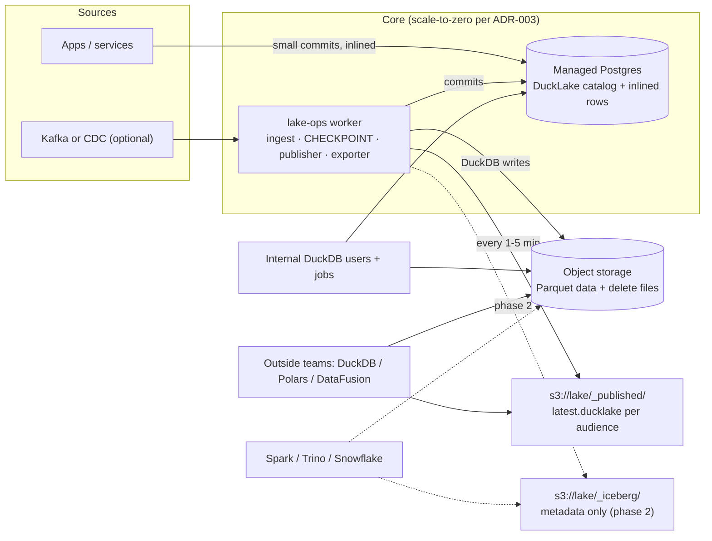

# ADR-001: Lakehouse foundation: DuckLake core, published snapshots for storage-only readers

**Status:** Proposed · **Date:** 2026-09-19 · **Deciders:** Alimardon + data lead

> **Amended by ADR-003:** host the DuckLake catalog on scale-to-zero Postgres (e.g. Neon, whose cold start is typically a few hundred ms) instead of always-on managed Postgres. Run the lake-ops tasks (ingest batches, `CHECKPOINT`, publishing) as scheduled jobs, so nothing is always on. Same code; only the hosting changes.

## TL;DR

1. **Stack:** DuckLake 1.0 with a catalog on plain managed Postgres, S3-compatible storage, and one small "lake-ops" worker that handles ingest, `CHECKPOINT` maintenance and publishing. DuckDB is the engine. No JVM, no Spark.
2. **Readers who only have the bucket:** every 1–5 minutes, publish a consistent copy of the catalog to the bucket as a read-only DuckDB file. This was tested end to end: a reader with bucket-only access sees current rows, time travel works, and writes are rejected.
3. **Spark, Trino and Snowflake readers:** add a *metadata-only* DuckLake→Iceberg exporter. It's feasible because DuckLake's data files already carry Parquet field IDs, so Iceberg manifests can point at them in place (verified). Only the small delete files need rewriting.
4. **Verdict on "develop it further": extend, don't build.** Build two small pieces (publisher ≈ days, exporter ≈ 4–6 engineer-weeks). Don't build a new format. PostHog is already building that and hasn't deployed it yet.
5. **Strongest alternative:** pg_lake. Switch to it if most outside readers are Spark or Snowflake teams from day one.

## Assumptions (not given, so chosen)

- S3-compatible object storage. About 1 TB today, growing past 100 TB. A data team of 2–5 people.
- Outside teams mostly query from SQL or Python. **This assumption is the most likely to change the recommendation** (see the Honest close section).
- Managed Postgres is available (RDS, Cloud SQL, Neon or similar). The DuckLake catalog uses only ordinary tables, so it needs no extensions.

## Context

Iceberg and Delta as usually deployed need Spark, a JVM, a separate catalog service, a separate query service, and a heavy extra stack for real-time. The goal is one simple, unified setup: fast writes, fast reads, streaming (streamhouse-style, but Apache Fluss is ruled out as JVM-based and too complex), reliable, and cheap to run. The one blocker for DuckLake: readers who have object-storage access but no catalog-database access.

---

## 1. DuckLake verdict

**Yes for now, and up to about 10x our starting scale if we follow the guardrails below. At 100x or thousands of tables, we'll need to decide whether to shard or move on.**

- **Maturity:** v1.0 (13 Apr 2026) is a stable spec with a backward-compatibility guarantee. The next spec (1.1, extension 2.0) is planned for fall 2026.
- **Features that match our needs:**
  - Data inlining: small inserts, deletes and updates go into catalog rows, not tiny Parquet files. All three were verified in the PoC.
  - A change feed (`table_changes`).
  - Built-in maintenance: `CHECKPOINT`, `merge_adjacent_files`, `expire_snapshots`, cleanup.
  - Encryption.
  - Iceberg-compatible bucket partitioning.
- **Ecosystem outside DuckDB is thin:**
  - MotherDuck (Jul 2026) says Spark, Trino and DataFusion can *read* DuckLake and that write support is being worked on.
  - Trino upstream support is still only a feature request.
  - DataFusion support is a community crate.
  - The pandas/Polars library is explicitly experimental.

### Where it breaks (evidence mostly from PostHog's production defect ledger)

| Pressure | What happened | Guardrail |
|---|---|---|
| Catalog size vs. commit cost | At 59,004 tables / 4.55M columns: 5–7 s of metadata I/O per commit; 190–264 s commits under concurrent load (made worse by orphaned stats; a hotfix brought it to 3.8–6.4 s) | Keep each catalog to hundreds or low thousands of tables. Shard by domain (one DuckLake per domain). *Threshold is my judgement.* |
| Concurrent writers on one table | Optimistic concurrency with retries. Open issues: concurrent writes failing (#233, #243); compaction conflicts at table level (#1452) | One writer per table. Maintenance runs from one scheduled worker only. |
| Long-lived writers + schema churn | 12.6 GiB/h memory growth at 315 schema versions/h, ending in OOM | Recycle writer processes; no per-event schema changes |
| Inlining at huge table counts | Registry of 112,947 inlined tables walked on every commit | Flush regularly with `CHECKPOINT` |
| Commit throughput | ~100 commits/s claimed (vendor number, unverified) on one Postgres primary | Batch commits; watch commit p95 |
| Multi-region | One catalog primary; remote writers pay a round trip per commit | Write in one region; publish snapshots per region for readers |
| Access control | No DuckLake RBAC yet (on the roadmap, marked "looking for funding") | Postgres roles + bucket IAM + per-audience publishing |

### If the catalog database is lost

The Parquet files alone are **not** enough. Snapshots, schema history, snapshot-scoped deletes and **inlined rows (which exist only in the catalog)** are gone. The docs cover backups and PITR, not rebuilding from Parquet. Two mitigations:

- Managed Postgres PITR.
- The publisher below. Every published snapshot is also an off-site copy of the catalog, so worst-case loss equals the publish interval.

---

## 2. Readers with only object storage

The core tension: Iceberg and Delta keep table metadata *on storage*, so any reader can find it. DuckLake deliberately moved metadata into a database, which is where its speed comes from. So storage-only reading requires *publishing* metadata to storage. Options:

| Option | Staleness | Consistency | Who can read | Ops | Exists today? | Main failure mode |
|---|---|---|---|---|---|---|
| **(a) Published catalog snapshot**: catalog tables copied into a DuckDB file on the bucket | = interval (1–5 min) | Full multi-table snapshot (verified: one `REPEATABLE READ READ ONLY` transaction) | DuckDB (CLI/Python/R/Node/WASM); Polars/pandas/PyArrow *through* DuckDB; DataFusion via `datafusion-ducklake` (untested with a file catalog) | 1 cron job, ~30 lines | **Yes.** The mechanism is documented and was verified here | Files deleted under readers; everything in the catalog (including encryption keys) is exposed |
| **(b) Iceberg metadata export** (metadata-only, no data copy) | = interval | Per table | Every Iceberg reader: Spark, Trino, Snowflake (object-store catalog + `REFRESH`), DuckDB, PyIceberg, Polars, Daft, Sail | Same worker | **No, has to be built** (est. 4–6 eng-weeks) | Inlined rows invisible until flushed; delete files need rewriting (field-ID mismatch) |
| **(c) Read-only Iceberg REST facade** | Seconds | Per table | REST-capable engines, with credential vending | New always-on service + auth | No: (b) plus ~3–4 weeks. PostHog's hoglake has it "designed, unbuilt" | Another service to run and secure; readers are no longer storage-only |
| **(d) Plain Parquet data products** | = interval | Per dataset, no time travel | Everything | Tiny | Yes | Duplicate data; readers get no ACID or history |
| **(e) Scheduled deep copy to Iceberg** (built into DuckLake since 0.3) | = interval | Per table | All Iceberg readers | Needs an Iceberg catalog; copies the full table each run | Yes | Cost grows with table size |

**Recommendation:**

- **(a) from day 1.**
- **(d) or (e) as a stopgap** for the first Spark or Snowflake consumer's few tables.
- **(b) once there are two or more such consumers,** or once the shared tables pass ~100 GB (my threshold).
- **(c) only if we turn this into a product.**

### Rules that make (a) safe

1. **Consistent read:** DuckDB's Postgres scanner already runs the whole copy in one `REPEATABLE READ READ ONLY` transaction (verified in Postgres logs). Write to a temporary file, then swap it in with a single PUT or rename.
2. **Copy table by table.** `COPY FROM DATABASE` fails on the catalog's indexes (documented; reproduced).
3. **Retention:** expire snapshots only when they're older than 24 h or more (much longer than publish interval + longest reader query). Otherwise, readers on an older published catalog hit deleted files.
4. **Security:**
   - The catalog stores per-file encryption keys (`encryption_key` column), so don't publish encrypted tables to audiences who shouldn't decrypt them.
   - Publish **per-audience catalogs** filtered to the tables each audience may see.
5. **Keep the last N published versions** (`catalog-<snapshot>.ducklake` plus `latest.ducklake`). Readers can pin a version, and the copies double as catalog backups.

Prior art: the "Frozen DuckLake" guest post (Oct 2025) uses the same idea for a static lake.

Reader side: `ATTACH 'ducklake:s3://lake/_published/latest.ducklake' AS lake (READ_ONLY);` plus an S3 secret. That's the whole setup.

---

## 3. The alternatives at their best (lightweight versions only)

| | DuckLake + publisher (recommended) | pg_lake | Iceberg + DuckDB + Lakekeeper (or S3 Tables / R2) | Delta via delta-rs |
|---|---|---|---|---|
| Storage-only readers | DuckDB family now; any engine after the exporter | Native (Iceberg metadata written to storage; needs a latest-version pointer) | Native | **Best:** no catalog at all; point any Delta reader at the path |
| Always-on parts, day 1 | Postgres + worker | Self-managed Postgres with extensions + `pgduck_server` (or Snowflake Postgres) | Postgres + Lakekeeper + compaction + ingest (1–2 if managed S3 Tables/R2) | Worker only |
| Small writes / streaming | **Best:** inlining of inserts, deletes and updates | Small files; auto VACUUM every 10 min | A metadata tree write per commit; streaming via RisingWave (another cluster) | Micro-batches; log and file churn |
| Compaction without Spark | Built in | Built in | DuckDB's is immature; auto on S3 Tables/R2 | delta-rs optimize/vacuum |
| Concurrency | Optimistic, many writers | All writes through one Postgres; UPDATE/DELETE lock the table; other engines can't write | Catalog-mediated | Per table; no multi-table transactions |
| Maturity | Spec 1.0 (Apr 2026) | **Highest:** two commercial generations, open source since Nov 2025 | DuckDB Iceberg INSERT since 1.4, UPDATE/DELETE since 1.4.2, MERGE since 1.5.3 (May 2026); Lakekeeper 0.13.x | delta-rs 1.6.4; DuckDB Delta writes are INSERT-only |
| Exit | Deep copy to Iceberg is built in; metadata-only after the exporter | Already Iceberg | It *is* the standard | UniForm / XTable |

**Verdict: DuckLake stays the best fit** for SQL-first simplicity, fast small writes and streaming. Each alternative wins under specific conditions:

- **pg_lake** wins if (i) most outside consumers are Spark, Trino or Snowflake from day one, and (ii) we're willing to run our own Postgres with extensions (or buy Snowflake Postgres).
- **Delta + delta-rs** wins if storage-only reading by *any* engine is the #1 requirement and DuckDB-style SQL ergonomics don't matter.
- **Iceberg + a managed catalog** wins if we commit to one cloud and want the widest engine ecosystem with the least custom code.

---

## 4. Develop it further? **Extend, don't build (and don't just adopt)**

**Build these (small, high leverage):**

1. **Publisher:** 2–3 days to productionize. The PoC published a 30-table catalog in 0.08 s; time grows with catalog rows, so measure it.
2. **Metadata-only Iceberg exporter:** about 4–6 engineer-weeks (estimate). The data files never get copied:
   - Data files carry Parquet field IDs (verified: `id→1, usr→2, amount→3`), so Iceberg manifests can reference them in place.
   - **Delete files must be rewritten.** They have the right column names (`file_path`, `pos`) but the wrong field IDs: DuckLake uses 2147483646/2147483645, which are Iceberg's `_file`/`_pos` metadata-column IDs, while Iceberg's positional delete files require 2147483546/2147483545 (verified against the spec). Rewriting costs only as much as the deletes, not the table.
   - The work:
     - Map columns, stats and partitions to an Iceberg schema, partition spec and metrics.
     - Write `metadata.json`, a manifest list and Avro manifests per table.
     - Flush inlined rows first.
     - Rewrite delete files (including partial ones) with Iceberg's positional-delete field IDs.
     - Write `version-hint.text` so path-based readers find the latest version.

**Don't build a new format or engine.** PostHog hit DuckLake's limits at 59K tables and is building **hoglake** (MIT): a Postgres-native catalog *service* with server-side commits, a retention-aware change feed and an Iceberg REST facade. Its README says it's feature-complete but "nothing is deployed, authenticated, or has touched production data." That's 6–12+ engineer-months to solve a problem we won't have until we have thousands of tables. Watch it, and contribute if we need it.

**Adopt instead if:**

- We'd rather pay than run it: MotherDuck (managed DuckLake).
- We standardize on one cloud: S3 Tables or R2 Data Catalog (managed Iceberg with auto-compaction). Cloudflare Pipelines can stream into R2 Data Catalog Iceberg tables.

*Platform note:* "SQL catalog inside, Iceberg outside" is exactly the exporter. If this project grows into a platform, the exporter is the part that sets it apart.

---

## Architecture



## Phased path

| Phase | Trigger | What changes | Exit route |
|---|---|---|---|
| **Day 1** (≈1 TB, 2–5 people) | Now | Managed Postgres + S3 + lake-ops worker (ingest; `CHECKPOINT` hourly; publish every 1–5 min). DuckDB for all compute (a bigger VM for heavy jobs). Kafka only if it already exists (a millpond-style consumer that flushes every ≤60 s; at-least-once, so dedupe on a key). | Built-in DuckLake→Iceberg deep copy; data is plain Parquet |
| **10x** (≈10 TB, dozens of writers, first Spark or Snowflake consumer) | First JVM/Snowflake consumer, or >~1–2K tables | Iceberg exporter for shared tables; per-audience catalogs; split catalogs by domain; Postgres HA + PITR; writer recycling | The exporter makes a move to Iceberg metadata-only |
| **100x** (100+ TB, thousands of tables, distributed jobs) | Single-node DuckDB not enough; commit p95 rising | Shard DuckLakes by domain. For distributed compute: Sail (Rust, Spark-compatible) / Daft / Trino via the Iceberg export, or DataFusion + `datafusion-ducklake` + Ballista. **Decide:** keep sharding, move the write path to an Iceberg REST catalog, or adopt a hoglake-style service | Register the exported Iceberg tables in any REST catalog |

## How this scores against the bar

| Done-statement | Status |
|---|---|
| Day 1: ≤3 always-on parts, no JVM, <1 h setup, ≤4 h/week upkeep | **Met.** Setup ran in minutes locally; the upkeep figure is an estimate |
| Storage-only readers ≤5 min stale from DuckDB + Polars/PyArrow + one of Spark/Trino/Snowflake | **Partly met.** DuckDB and Arrow (through DuckDB) verified; Spark/Trino/Snowflake need the phase-2 exporter or a deep-copy stopgap |
| Streaming queryable in ≤60 s without Kafka/Flink/Spark, compaction explained | **Met for internal readers** (inlining verified). Outside readers see new data after the next publish |
| Phased path with exits | **Met** |
| Claims cited; unverified labelled | **Met** |

## Honest close

**Still uncertain:**

1. Which of PostHog's reported defects are fixed in DuckLake 1.0.x. Unverified.
2. The ~100 commits/s figure. It's a vendor claim.
3. The exporter. Validated at the file-format level only (data files reusable; delete files need rewriting); no end-to-end Spark or Snowflake read yet.
4. Publish time with millions of file rows. Unmeasured.
5. Whether `datafusion-ducklake` / `ducklake-spark` accept a DuckDB-file catalog on S3. Unverified.
6. Whether your managed Postgres allows the pg_ducklake or pg_lake extensions. Check with your provider.

**Riskiest assumption:** that outside consumers are mostly DuckDB or Python users. If they're mostly Spark or Snowflake teams today, the exporter becomes day-1 critical path and **pg_lake becomes the better default**.

**One-week PoC with kill criteria:**

- **Day 1–2:** DuckLake on your real managed Postgres + bucket. Load ~100 GB across ~50 real tables. Run a streaming writer at your real event rate.
- **Day 3:** Publisher every 1 min. Measure publish time, staleness, and reader latency from a separate account that has bucket-only credentials.
- **Day 4:** Chaos testing. Run `CHECKPOINT` and cleanup while readers use older snapshots. Kill Postgres and restore it, once from PITR and once from a published snapshot.
- **Day 5:** Hand-write Iceberg metadata for one table and read it from Spark, Trino or Snowflake.
- **Kill it (switch to pg_lake) if** publish takes more than 60 s, commit p95 goes above 2 s, any reader error survives the retention rules, or the Iceberg read fails.

---

## Appendix: what was verified in the PoC (DuckDB 1.5.5, DuckLake extension, Postgres 16)

- A DuckLake on a Postgres catalog: a 100k-row bulk insert went to Parquet; 3-row inserts, deletes and updates were all **inlined** into the catalog.
- The publisher copied all 30 catalog tables into a DuckDB file in 0.08 s. Postgres logs show a single `BEGIN TRANSACTION ISOLATION LEVEL REPEATABLE READ READ ONLY` wrapping all 30 table copies.
- `COPY FROM DATABASE` failed on the catalog's indexes, as the docs warn. Copying table by table works.
- A fresh reader with **only HTTP access** attached the published file with `READ_ONLY` and got:
  - the correct count;
  - the inlined rows;
  - the updated value;
  - time travel to version 1;
  - Arrow output;
  - a rejected INSERT.

  (`OVERRIDE_DATA_PATH` was needed only because the test lake used a local path; a lake on `s3://` doesn't need it.)
- Data files carry Parquet field IDs. Delete files have `file_path`/`pos` columns with IDs 2147483646/2147483645, which are Iceberg's `_file`/`_pos` IDs, **not** the 2147483546/2147483545 that Iceberg's positional delete files require.

```python
# publisher.py: consistent, read-only snapshot of a DuckLake Postgres catalog -> DuckDB file
import duckdb, os
def publish(pg_dsn: str, out: str):
    tmp = out + ".tmp"
    if os.path.exists(tmp): os.remove(tmp)
    con = duckdb.connect(); con.sql("LOAD postgres_scanner")
    con.sql(f"ATTACH '{pg_dsn}' AS pg (TYPE postgres, READ_ONLY)")
    con.sql(f"ATTACH '{tmp}' AS snap")
    tables = [r[0] for r in con.sql("SELECT table_name FROM duckdb_tables() "
              "WHERE database_name='pg' AND schema_name='public'").fetchall()]
    con.sql("BEGIN")                       # one REPEATABLE READ snapshot in Postgres
    for t in tables:                       # tables only: COPY FROM DATABASE trips on indexes
        con.sql(f'CREATE TABLE snap."{t}" AS SELECT * FROM pg.public."{t}"')
    con.sql("COMMIT"); con.sql("DETACH snap")
    os.replace(tmp, out)                   # atomic swap; on S3, upload tmp then PUT to the fixed key
```

## Sources

- DuckLake release calendar, https://ducklake.select/release_calendar (v1.0 2026-04-13; 1.1 planned fall 2026)
- DuckLake 1.0 announcement, https://ducklake.select/2026/04/13/ducklake-10/
- DuckLake 0.3 (Iceberg interop), https://ducklake.select/2025/09/17/ducklake-03/
- Public DuckLake on object storage, https://ducklake.select/docs/stable/duckdb/guides/public_ducklake_on_object_storage
- Backup and recovery, https://ducklake.select/docs/stable/duckdb/guides/backups_and_recovery
- Data inlining, https://ducklake.select/docs/stable/duckdb/advanced_features/data_inlining
- Data change feed, https://ducklake.select/docs/stable/duckdb/advanced_features/data_change_feed
- Delete file spec, https://ducklake.select/docs/stable/specification/tables/ducklake_delete_file
- Roadmap, https://ducklake.select/roadmap.html
- Frozen DuckLake (guest post, 2025-10-24), https://ducklake.select/2025/10/24/frozen-ducklake/
- DuckLake → DataFusion (2026-07-29), https://ducklake.select/2026/07/29/bringing-ducklake-to-datafusion/
- ducklake-dataframe (experimental, 2026-05-04), https://ducklake.select/2026/05/04/ducklake-dataframe/
- MotherDuck, DuckLake architecture deep dive (2026-07-14), https://motherduck.com/blog/ducklake-architecture-deep-dive/
- Streaming ingestion discussion #1252, https://github.com/duckdb/ducklake/discussions/1252
- DuckLake issues #243 / #1452, https://github.com/duckdb/ducklake/issues
- pg_ducklake v1.0 (2026-06-17), https://pgducklake.select/blog/releasing-v1/
- PostHog hoglake, https://github.com/PostHog/hoglake · defect ledger: https://github.com/PostHog/hoglake/blob/main/docs/ducklake-defect-ledger.md
- PostHog millpond (Kafka → DuckLake), https://github.com/PostHog/millpond
- Trino DuckLake feature request, https://github.com/trinodb/trino/issues/26523
- pg_lake, https://github.com/Snowflake-Labs/pg_lake · Iceberg tables doc: https://github.com/Snowflake-Labs/pg_lake/blob/main/docs/iceberg-tables.md
- Postgres meets the lakehouse (2026-09-02), https://datalakehousehub.com/blog/postgres-meets-the-lakehouse/
- DuckDB Iceberg writes (2025-11-28), https://duckdb.org/2025/11/28/iceberg-writes-in-duckdb · new Iceberg features (2026-05-29): https://duckdb.org/2026/05/29/new-iceberg-features
- DuckDB Delta/UC updates (2026-05-07), https://duckdb.org/2026/05/07/delta-uc-updates
- Lakekeeper release notes, https://docs.lakekeeper.io/about/release-notes/
- deltalake (delta-rs) on PyPI, https://pypi.org/project/deltalake/
- AWS S3 Tables, https://aws.amazon.com/s3/features/tables/ · R2 Data Catalog maintenance: https://developers.cloudflare.com/r2-data-catalog/table-maintenance/
- Cloudflare Pipelines → R2 Data Catalog, https://developers.cloudflare.com/pipelines/sinks/available-sinks/r2-data-catalog/
- Iceberg table spec (reserved field IDs), https://github.com/apache/iceberg/blob/main/format/spec.md
- Snowflake: Iceberg files in object storage, https://docs.snowflake.com/en/sql-reference/sql/create-iceberg-table-iceberg-files
- Sail 0.7, https://lakesail.com/blog/sail-0-7-blocking-shuffle-checkpoint/ · datafusion-ducklake: https://docs.rs/datafusion-ducklake
- RisingWave Iceberg streaming (2026-04-08), https://risingwave.com/blog/apache-iceberg-streaming-2026/
