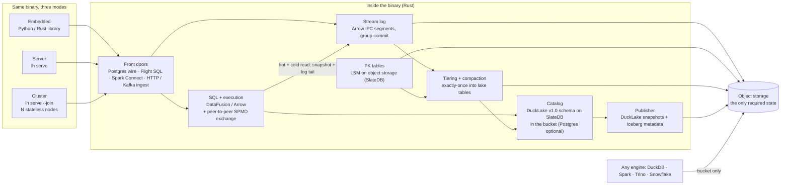

# ADR-002: A streamhouse in one binary: the Fluss verdict and a single-binary platform architecture

**Status:** Proposed · **Date:** 2026-09-19 · **Builds on:** ADR-001 (DuckLake core, published snapshots, Iceberg exporter) · **Working name for the binary:** `lh` · **Amended by:** ADR-003 (serverless catalog in the MVP; peer-to-peer SPMD for distributed mode)

## TL;DR

1. **Fluss:** great ideas, wrong package for us. Borrow the ideas (columnar log, primary-key tables with changelog and lookups, hot+cold reads in one query, tiering to the lake), not the system (JVM servers, ZooKeeper, tiering that runs as a Flink job).
2. **Simple streamhouse:** object storage is the only required state. A stream log and primary-key tables tier into our DuckLake/Iceberg tables, and one SQL query reads hot and cold data consistently.
3. **Single binary:** feasible for storage, SQL, streaming and sharing, laptop to cluster. GreptimeDB, RisingWave standalone, Redpanda and Tansu each show a piece of this. "Everything Databricks/Snowflake do" is not feasible: own the core, integrate the rest.
4. **Engine:** build on **DataFusion** (Rust), not DuckDB. DuckDB is staying single-node (its Quack protocol is client-server, not distributed). DataFusion already has distributed paths (`datafusion-distributed`, Ballista, Sail) and is at DuckDB's speed class. ADR-003 picks peer-to-peer SPMD.
5. **Thesis:** *the open streamhouse in one binary: DuckDB-simple on a laptop, Snowflake-shaped on a cluster, every table readable straight from the bucket.*
6. **Next:** a 4-week prototype with kill criteria. If it fails, stay on ADR-001 plus an off-the-shelf streaming engine.

## Assumptions (chosen, since not given)

- **Team:** 3–5 engineers with Rust experience.
- **License:** open-source core (Apache 2.0), with a managed cloud later.
- **Storage:** any S3-compatible object storage.
- **First users:** our own company (ADR-001), then teams under ~100 TB who find Databricks/Snowflake too heavy.

**What would change the verdict:**

- **C++-heavy team:** build on DuckDB extensions instead, and give up native distribution.
- **First customers need PySpark compatibility on day one:** build directly on Sail.
- **Closed-source plan:** same architecture; the open-format argument still holds.

---

## 1. Fluss: what it does well, and are the concerns valid?

**What it does well (verified):**

- **Columnar log:** an Apache Arrow log with column pruning and predicate pushdown. That's what Kafka lacks.
- **Primary-key tables:** a RocksDB key-value store plus a changelog, enabling first-class lookup joins and delta joins. At one Alibaba search/recommendation team, delta joins cut Flink state from 100 TB to about 0, and checkpoints from 90 s to 1 s.
- **Hot+cold reads:** one read sees the hot tier and the lake together; tiering goes to Paimon, Iceberg, Hudi or Lance.
- **Real production:** Alibaba reports 3+ PB, 40 GB/s ingest and 500K QPS on one table. It also runs at RedNote, JD.com and Ant Group. It became an Apache Top-Level Project on 6 Aug 2026; the latest stable release is 0.9.1, and 1.0 is being finalized.

**Your concerns:**

| Concern | Verdict | Evidence |
|---|---|---|
| JVM | **Valid** | The servers are Java. Tiering into the lake runs as a **Flink job**. The Rust/Python/C++ clients only reached 0.1.0 in Apr 2026. |
| Setup complexity | **Valid** | ZooKeeper + CoordinatorServer + TabletServers + remote storage + Flink for tiering + a lake catalog: 5+ moving parts. |
| Reliability | **Partly valid** | ZooKeeper-based controller without KRaft-style hardening against correlated failures. On failover, a new key-value leader must download a RocksDB snapshot and replay, an availability risk with large state. Hot data isn't expired once tiered. An HA coordinator is only on the 1.0 roadmap, and an open issue asks for a production-readiness checklist. **But** it runs at Alibaba scale: reliable with Alibaba's operators, which is not the same as reliable for a small team. |

### What a streamhouse must provide

- **R1:** an ordered, schema'd append log with offsets and replay.
- **R2:** primary-key tables with upserts, millisecond point lookups and a changelog.
- **R3:** one query that sees hot and cold data at a consistent point.
- **R4:** exactly-once tiering into an open table format, with bounded freshness.
- **R5:** incremental SQL (materialized views over the log).
- **R6:** retention that knows about tiering and consumers.

**Verdict: DROP Fluss as a dependency; BORROW the four ideas.** Revisit if Fluss 1.x removes ZooKeeper and ships direct-to-object-storage writes (both on its roadmap).

---

## 2. A simple streamhouse that fits the DuckLake direction

**Key insight: DuckLake already provides about half of a streamhouse** (verified in the ADR-001 PoC):

- **Inlining is a hot tier:** small inserts, deletes and updates live in catalog rows and are visible in the same snapshot as the Parquet data. That covers R3 at small scale.
- **Flushing is tiering** (R4).
- **`table_changes` is a changelog** (R2, partly).

What's missing:

- A high-rate log. Postgres as the hot tier caps throughput, and PostHog hit inlining-registry problems at scale.
- Consumer offsets.
- Primary-key point lookups.
- A low-latency tail.
- Kafka-protocol ingress.

### Step A: now, for the company, no new systems

Add three things to the ADR-001 stack:

- a consumer-offset table in Postgres;
- a changefeed reader over `table_changes`;
- micro-batch commits every ≤1 s.

Its throughput ceiling is **unmeasured; benchmark it** (see prototype week 4).

### Step B: the product's streamhouse, inside the binary

| Part | Design | Build or reuse |
|---|---|---|
| **Log** (R1) | Arrow IPC segments written to object storage with group commit every 100–250 ms, per-partition sequence numbers and offsets. **One object per node per flush holds all partitions** (WarpStream's approach), so request cost scales with nodes, not partitions: 1 node at 4 flushes/s ≈ 10M PUTs/month ≈ $50 at S3 Standard list price. No local replicated disks; durability comes from object storage. Optional S3 Express One Zone for sub-100 ms latency. | **Build** (thin) on Arrow + `object_store` |
| **Primary-key tables** (R2) | LSM on object storage: upserts, point lookups, changelog emitted on write. One SlateDB instance per table partition, since SlateDB allows one writer; partitions spread across nodes. | **Reuse SlateDB** (Apache 2.0; single writer with formally verified fencing, many readers; used by Dropbox and S2) |
| **Tiering** (R4) | Compact log and PK segments into Parquet. Commit the data files **and the "tiered up to offset N" marker in one catalog transaction**, so tiering is exactly-once by construction. | **Build** |
| **Hot+cold read** (R3) | A DataFusion table source that reads lake snapshot S plus log records from S's tiered offset up to the high-water mark fixed at query start. Consistent because the offset is committed with the snapshot, and the upper bound is fixed. | **Build** (the core IP) |
| **Retention** (R6) | Drop a log segment only when it is tiered **and** every consumer has passed it. This fixes Fluss's lifecycle gap and matches hoglake's consumer-offset floor. | **Build** |
| **Ingress** | HTTP/Arrow Flight first; Kafka protocol in v1. Tansu shows a ~40 MB static Rust Kafka-compatible broker using ~20 MB RAM that writes Iceberg/Delta. | **Build**, using Tansu as the reference |
| **Incremental SQL** (R5) | MVP: micro-batch materialized views over the changefeed. v1: embed **DBSP** (Feldera, MIT), which incrementalizes full SQL. | **Integrate** |

**Verdict: BUILD the thin layer that differentiates us** (log, hot+cold read, tiering, offsets and retention). **BORROW** SlateDB, Arrow, DataFusion, `object_store` and the DuckLake spec. **INTEGRATE** DBSP later.

---

## 3. The single binary: architecture and feasibility

**Feasibility verdict:** a DuckDB-simple binary that goes from embedded to server to cluster **is feasible**, and each piece has a precedent:

- GreptimeDB runs the same binary standalone or distributed.
- RisingWave has a single-process standalone mode with embedded SQLite and a local filesystem.
- Redpanda is a single C++ binary with built-in Raft and no ZooKeeper.
- Databend is a Rust query engine plus a Raft-based metadata service.

Laptop-to-PB is feasible **in architecture**: object storage plus stateless compute is Snowflake's own design. It is **unproven for our engine**. "Does everything Databricks/Snowflake do" is **not** feasible for 3–5 people (see §4).

### Engine choice: DataFusion over DuckDB

| | DuckDB | DataFusion |
|---|---|---|
| Single-node speed | Top class | Top class: ClickBench partitioned Parquet, fastest on c7a.metal-48xlarge and 2nd on c6a.4xlarge (v55, Aug 2026) |
| Embeddable, small | Yes (~20 MB CLI) | Yes (Rust crate, Python bindings) |
| Distributed | **No.** Quack (1.0 due with DuckDB 2.0, Oct 2026) is a client-server protocol, and MotherDuck distributes as a service | **Yes:** Ballista v54 (Jul 2026); Sail (Rust, Spark Connect, ~10x Spark on TPC-H SF100, vendor benchmark) |
| Extensibility | C++ extensions | Built to be extended: custom table sources, planners, operators |
| Existing lake connectors | DuckLake native, Iceberg | `datafusion-ducklake`, `iceberg-rust` integration |

DuckDB remains a first-class **client**: every table is readable by DuckDB through the published DuckLake snapshots (ADR-001).

### Three modes, one binary

| Mode | How you run it | State |
|---|---|---|
| **Embedded** | `pip install` / Rust crate; the engine runs in-process, like DuckDB | Local directory + local catalog file |
| **Server** | `lh serve`: one process with a Postgres wire endpoint, Flight SQL, Spark Connect and HTTP | Local disk or S3; catalog on SlateDB in the bucket (Postgres optional; ADR-003) |
| **Cluster** | `lh serve --join <any-node>`: N copies of the same binary; no fixed roles: any node coordinates the queries it receives (ADR-003) | **Object storage is the only required state** |

### No ZooKeeper, no etcd, no metastore

- **Coordination:** S3 conditional writes (`If-None-Match` since Aug 2024, `If-Match` compare-and-swap since Nov 2024) provide leases and fencing. SlateDB already uses formally verified manifest fencing on object storage.
- **Catalog (changed by ADR-003):** from the MVP on, the DuckLake v1.0 schema is stored on SlateDB in the bucket (RockLake's approach), embedded in the binary. The writer lease holder commits with group commit. It still **publishes DuckLake snapshots and Iceberg metadata**, so ADR-001's publisher and exporter become product features. Postgres is an optional adapter.
- **Failover:** the log writer and catalog writer hold S3 leases. If a node dies, another takes the lease and the old writer is fenced out, so no Raft group is needed.
- **Compute:** compute nodes are stateless and can scale to zero. Distributed execution is peer-to-peer SPMD (ADR-003): the same plan runs on every peer, Arrow streams directly between them, and long jobs checkpoint stage outputs to object storage (as Sail 0.7 does).

### Budgets, tied to evidence

| Budget | Target | Evidence | Status |
|---|---|---|---|
| Binary size | ≤150 MB | DuckDB CLI ≈20 MB (v1.5.5 linux-amd64); Tansu ≈40 MB static | Plausible; the full binary (DataFusion + SlateDB + protocols) is **unproven, measure it** |
| Idle memory | ≤200 MB | Tansu ≈20 MB | Plausible |
| Cold start | <1 s | Tansu ≈10 ms; DuckDB embedded | Plausible |
| Stream → query | ≤5 s | WarpStream p99 end-to-end <2 s on S3 Standard, <50 ms on S3 Express One Zone (vendor-run) | **Backed** |
| Stream → open format | ≤60 s | RisingWave Iceberg sink every 30–60 s; millpond flushes every 60 s | **Backed** |
| Laptop scale | ~100 GB | DuckDB-class engines do this routinely | **Backed** |
| Upper scale | 1 PB | Fluss 3+ PB (streaming storage, at Alibaba); Smallpond 100+ TB; Sail only published SF100 | **Unproven for us: the biggest open claim** |
| Single-node speed | ≈ DuckDB/ClickHouse | DataFusion ClickBench results above (vendor-run) | Backed, with a vendor caveat |

### Architecture diagram

### The hard parts, ranked

1. **The boundary between stream and table:** exactly-once tiering, consistent hot+cold reads and safe retention, all under crashes. This is the core IP and the core risk.
2. **Distributed query at PB scale:** shuffle, skew, spill, adaptive execution. Spark and Snowflake have 10+ years here, so lean on DataFusion and `datafusion-distributed` rather than writing our own. Stage recovery and skew handling are ours (ADR-003).
3. **A single-writer catalog on object storage:** group-commit latency vs. commit rate. PostHog's DuckLake ledger shows catalog costs growing with table count (5–7 s commits at 59K tables).
4. **Enterprise security and governance:** long, unglamorous, and required for enterprise deals.

**Verdict: BUILD** the binary shell, modes, streamhouse layer and catalog. **BORROW** DataFusion, Arrow, SlateDB and `object_store`. **EVALUATE** Sail only as the Spark Connect (PySpark) front door; distributed execution follows ADR-003.

---

## 4. Capability matrix vs Databricks / Snowflake

| Workload | Verdict | How | Effort (est.) | Phase |
|---|---|---|---|---|
| SQL warehousing / BI | **Parity target** | DataFusion SQL; Postgres wire + Flight SQL for BI tools | ~6 eng-months to production quality | MVP |
| Batch ELT | **Parity target** | SQL + MERGE + scheduled SQL tasks; PySpark via Spark Connect | ~4 eng-months (+Spark Connect: adopt Sail or ~6 more) | MVP / v1 |
| Streaming | **Differentiator** | Streamhouse layer (§2): log, PK tables, hot+cold reads, tiering, DBSP | ~12–18 eng-months | MVP (log + hot/cold) / v1 (PK + incremental views) |
| Python / dataframes | **Integrate** | Arrow-native Python package; Polars/pandas zero-copy | ~2 eng-months | MVP |
| ML: training / features / serving | **Integrate** (features partly differentiated) | PK tables = online features; tiered lake tables = offline features from the same table. Training via Ray/PyTorch over Arrow. No model serving | ~2 eng-months | v1 |
| AI functions / vector search | **Integrate** | LLM calls as UDFs; vectors via a Lance-format or DataFusion extension | ~3 eng-months | v1 |
| Governance (catalog, RBAC, lineage) | **Parity-lite, required** | RBAC, row/column masking, audit log, OpenLineage events from query plans | ~6–9 eng-months | v1 |
| Data sharing | **Differentiator (cheap)** | Per-audience published snapshots + Iceberg metadata (ADR-001): recipients need only bucket access | ~1–2 eng-months | MVP |
| Notebooks / apps | **Integrate, don't build** | Jupyter / marimo / Streamlit via the Python package | ~0 | n/a |
| Semi-structured | **Parity target** | VARIANT (DuckLake 1.0 has it; Parquet variant encoding) | ~3 eng-months | v1 |
| Postgres-style OLTP (Lakebase / Unistore) | **Out of scope for v1** | Integrate: Postgres logical-replication CDC into the streamhouse | ~2 eng-months | v1 |

**Totals, roughly:**

- **MVP:** ~19–21 eng-months, i.e. 3–4 engineers × 6 months.
- **v1 additions:** ~40–50 eng-months, i.e. **8–12 engineers** for the next 12 months.

Parity with the *whole* Databricks/Snowflake surface (Unity-grade governance, marketplace, serving, notebooks, OLTP) is a multi-year, 50+ engineer effort. That's why most rows say integrate.

---

## 5. Prior art: what's been tried and what it teaches

| System | What it proves | Lesson for us |
|---|---|---|
| DuckDB / MotherDuck | Simplicity wins adoption. Quack (beta May 2026, 1.0 with DuckDB 2.0 in Oct 2026) brings client-server and multi-writer. MotherDuck distributes as a *service* | DuckDB will stay single-node. The gap is distribution plus streaming, so treat DuckDB as a client, not the core |
| DataFusion / Ballista | A production-grade Rust engine kit; Ballista active (v54) | The right core; its distributed layer is young |
| LakeSail Sail | Rust DataFusion-based Spark replacement with Spark Connect; distributed; state moved to object storage | PySpark compatibility is the migration path off Databricks; adopt or learn from it |
| Databend | Rust "Snowflake alternative": query nodes + a Raft metadata service; Apache 2.0 core + Elastic-licensed enterprise features | A Snowflake-shaped Rust engine is buildable; public adoption evidence is thin (named users unverified) |
| ClickHouse | A single binary can be blazing fast | The object-storage-native replication (SharedMergeTree) is Cloud-only per Altinity; clusters need Keeper. Vendors close-source the cloud-native piece |
| RisingWave | Streaming DB with a standalone single-binary mode (embedded SQLite + local FS) and an exactly-once Iceberg sink | Streaming + Iceberg in one binary works; it's streaming-first, not analytics-first |
| Arroyo → Cloudflare Pipelines | Rust SQL streaming to Iceberg on R2 | Small Rust streaming teams get acquired; a managed alternative exists |
| Timeplus Proton | C++ single binary: streaming + ClickHouse-derived historical store (Apache 2.0) | The closest "streamhouse in one binary"; limited ecosystem (current status unverified) |
| Feldera (DBSP) | Full-SQL incremental view maintenance, MIT | Embed it rather than write incremental SQL ourselves |
| Redpanda | One C++ binary with Raft replaced JVM Kafka + ZooKeeper | The "Kafka without the JVM" precedent; BSL-licensed |
| WarpStream / Bufstream / AutoMQ / KIP-1150 | Streaming directly on object storage is mainstream (KIP-1150 diskless topics accepted Mar 2026) | Be object-storage-native from day one; no replicated local disks |
| Tansu (now Nisshi) | ~40 MB Rust Kafka-compatible broker, ~20 MB RAM, writes Iceberg/Delta | Our ingress budget is realistic; it also lacks ACLs and S3 compaction, so those are ours to solve |
| Fluss | The streamhouse ideas at Alibaba scale | Borrow the ideas, not the stack |
| PostHog hoglake | Catalog-as-a-service, changefeed with consumer offsets and an Iceberg facade, after DuckLake broke at 59K tables | Plan the v1 catalog for many tables and many consumers from the start |

**Why the gap still exists:** every piece exists, but **nobody ships them together** in one open binary: an embedded mode, a distributed mode, a streaming log with PK tables, and open formats readable from the bucket. Incumbents monetize exactly the cloud-native piece: ClickHouse's SharedMergeTree, MotherDuck's distribution, Redpanda's BSL, Bufstream's proprietary license. The **unclaimed position** is an *open, single-binary, streaming-native lakehouse, laptop → cluster*.

**Threats:**

- **DuckDB + DuckLake + MotherDuck add streaming.** This is the nightmare scenario: they own "simple".
- **Databricks and Snowflake embrace Iceberg,** which weakens the lock-in argument.
- **RisingWave adds analytics depth.** Monitor all three.

---

## Roadmap

### MVP: 6 months, 3–5 engineers

- One Rust binary with **embedded and server modes**.
- DataFusion SQL; Postgres wire + Flight SQL.
- DuckLake-compatible catalog on SlateDB in the bucket (ADR-003), with an optional Postgres adapter; Parquet on local disk or S3.
- The **stream log** with HTTP/Flight ingest and group commit, **hot+cold reads**, and exactly-once tiering.
- The **publisher** (DuckLake snapshots) and **Iceberg metadata exporter** from ADR-001.
- Scheduled SQL tasks; a Python package.
- **Cluster mode = read scale-out only:** N stateless readers on one catalog + bucket.

### v1: 18 months, growing to 8–12 engineers

- **Distributed query:** peer-to-peer SPMD with stage recovery (ADR-003).
- PK tables on SlateDB with point lookups and a changelog.
- DBSP incremental views.
- Multi-writer catalog routing through leases in the bucket (ADR-003).
- Kafka-protocol ingress; Spark Connect.
- RBAC, masking, audit, OpenLineage; VARIANT; Postgres CDC.

### 4-week prototype: proves or kills the thesis

*Superseded by the updated prototype in ADR-003, which adds catalog, cold-start and SPMD criteria.*

- **Week 1:** Rust binary (DataFusion + `object_store`). Append endpoint writing Arrow IPC segments to S3 with 250 ms group commit. Offsets in SQLite.
- **Week 2:** Tiering to Parquet with DuckLake catalog commits (reuse the ADR-001 Postgres catalog), with the tiered offset committed in the same transaction. A hot+cold table source.
- **Week 3:** The publisher; DuckDB reads the tables from the bucket. Three instances of the binary serve reads against the same bucket + catalog.
- **Week 4:** Measurements:
  - sustained 50k events/s on one node;
  - freshness p99;
  - crash tests (kill -9 during group commit and during tiering);
  - query speed vs DuckDB on the same Parquet;
  - binary size and idle memory.

**Continue only if all of these hold:**

- freshness p99 ≤5 s at ≥50k events/s;
- **0 lost and 0 duplicated rows** across 20 crash runs;
- binary ≤150 MB and idle memory ≤200 MB;
- query speed within 2x of DuckDB.

**Otherwise:** keep ADR-001 and add RisingWave standalone or Feldera for streaming.

---

## How this scores against the bar (after review)

| Done-statement | Status |
|---|---|
| Budgets set and tied to evidence | **Met.** 4 backed by other systems' numbers; 3 plausible from small-binary precedents but must be measured (size, memory, cold start); **1 PB is unproven**, and flagged |
| Each answer ends in a verdict | **Met:** Drop/Borrow (1), Build/Borrow/Integrate (2), Build/Borrow/Evaluate (3), per-row verdicts (4), unclaimed position + threats (5) |
| Concrete roadmap + 4-week prototype with kill criteria | **Met.** The effort figures are estimates, not measurements |
| Claims cited; unverified labelled | **Met.** Vendor benchmarks are marked as vendor-run |

## Honest close

**Truly out of reach (for 3–5 people, 18 months):**

- Parity with the full Databricks/Snowflake surface: Unity-grade governance, marketplace, model serving, notebooks, OLTP.
- Proven PB-scale distributed performance.

The plan owns the core and integrates the rest; whether "does everything" is ever reached depends on funding and team growth, not architecture.

**Hardest technical problem:** the stream/table boundary: exactly-once tiering, consistent hot+cold reads and consumer-aware retention under failures. It's also the part nobody hands us.

**Riskiest assumption:** that DataFusion (plus `datafusion-distributed`) covers ~80% of the engine, so a small team can spend its effort on the streamhouse layer. If we end up maintaining a DataFusion fork, the budget doubles.

**Second risk:** positioning. DuckDB Labs/MotherDuck adding streaming would take the "simple" story. Speed to a usable MVP matters more than feature count.

**What the 4-week prototype must show:** the kill criteria above. The non-negotiable is **zero loss and zero duplicates across crash tests** at ≥50k events/s. Speed can be tuned later; correctness at the stream/table boundary cannot.

## Sources

- Fluss graduates to TLP (2026-08-06): https://fluss.apache.org/blog/apache-fluss-graduates-to-top-level-project/
- Fluss downloads: https://fluss.apache.org/downloads/ · 1.0 roadmap: https://github.com/apache/fluss/discussions/2684
- Fluss architecture: https://fluss.apache.org/docs/next/concepts/architecture/ · tiering service: https://fluss.apache.org/docs/1.0/streaming-lakehouse/tiering-service/
- Fluss Rust client 0.1.0: https://fluss.apache.org/blog/fluss_rust_client_release/
- Alibaba Fluss production numbers (2025-07-28): https://www.alibabacloud.com/blog/602412
- Jack Vanlightly, Understanding Apache Fluss (2025-09-02): https://jack-vanlightly.com/blog/2025/9/2/understanding-apache-fluss
- DuckDB 2.0 alpha (2026-09-02): https://duckdb.org/2026/09/02/try-duckdb-20-alpha · Quack (2026-05-12): https://duckdb.org/2026/05/12/quack-remote-protocol · releases: https://github.com/duckdb/duckdb/releases
- DataFusion 55.0.0 (2026-08-25): https://datafusion.apache.org/blog/output/2026/08/25/datafusion-55.0.0/ · Ballista 54 (2026-07-12): https://datafusion.apache.org/blog/output/2026/07/12/datafusion-ballista-54.0.0/
- Sail TPC-H 2026: https://lakesail.com/blog/tpch-benchmark-2026/ · Sail 0.7: https://lakesail.com/blog/sail-0-7-blocking-shuffle-checkpoint/ · repo: https://github.com/lakehq/sail
- Databend license: https://docs.databend.com/guides/self-hosted/editions/enterprise/license · databend-meta: https://github.com/databendlabs/databend-meta
- GreptimeDB: https://github.com/GreptimeTeam/greptimedb
- RisingWave standalone mode: https://docs.risingwave.com/operate/rw-standalone-mode · Iceberg streaming (2026-04-08): https://risingwave.com/blog/apache-iceberg-streaming-2026/
- ClickHouse SharedMergeTree: https://clickhouse.com/docs/cloud/reference/shared-merge-tree · Altinity view: https://altinity.com/blog/is-clickhouse-moving-away-from-open-source
- Timeplus Proton: https://www.timeplus.com/post/timeplus-journey-to-open-source
- Feldera: https://github.com/feldera/feldera
- Redpanda licensing: https://docs.redpanda.com/current/get-started/licensing/overview/
- WarpStream benchmarks: https://www.warpstream.com/blog/warpstream-benchmarks-and-tco · Bufstream Jepsen: https://jepsen.io/analyses/bufstream-0.1.0 · KIP-1150 accepted: https://aiven.io/blog/kip-1150-accepted-and-the-road-ahead
- Tansu (InfoQ, 2026-03-21): https://www.infoq.com/news/2026/03/tansu-stateless-kafka-compatible/
- SlateDB: https://slatedb.io/
- S3 conditional writes: https://aws.amazon.com/about-aws/whats-new/2024/11/amazon-s3-functionality-conditional-writes
- PostHog hoglake and DuckLake defect ledger: https://github.com/PostHog/hoglake
- Smallpond → Quack retrospective: https://dev.to/amirsefati/from-deepseek-to-quack-when-the-dream-of-distributed-duckdb-started-to-feel-real-188m
