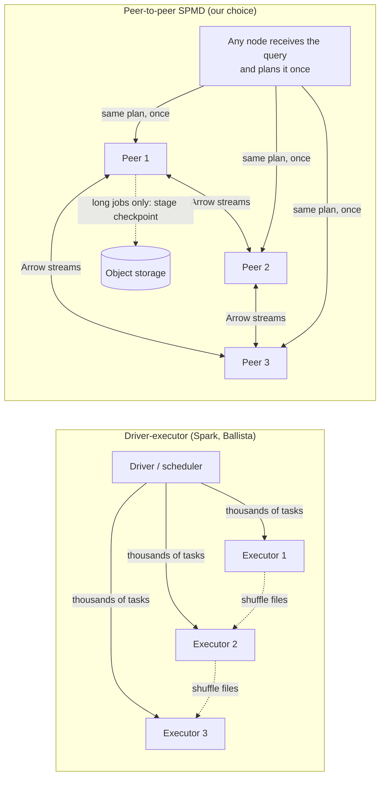

# ADR-003: Serverless by default, peer-to-peer SPMD for distributed mode

**Status:** Proposed · **Date:** 2026-09-19 · **Amends:** ADR-002 (catalog, distributed execution, roadmap) and ADR-001 (catalog hosting)

## TL;DR

1. **Serverless: yes, as the default.** Object storage is the only thing that holds state: no Postgres, no ZooKeeper, no metastore. When nobody is querying or ingesting, nothing runs. RockLake already shows that a DuckLake v1.0 catalog can live on SlateDB inside the bucket.
2. **The honest limit:** streaming needs *something* awake while data is flowing. We make that either the producers themselves (they embed the library) or an ingest process that starts in milliseconds and exits when traffic stops.
3. **Distributed mode: yes to Bodo's idea, no to Bodo's implementation.** The idea: every node runs the same program on its share of the data and exchanges data directly, with no driver/executor scheduler. Bodo's implementation doesn't fit us: MPI kills the whole job when one node dies and can't resize, and BodoSQL needs Java (Apache Calcite).
4. **How we do it:**
   - a `datafusion-distributed`-style peer-to-peer plan: any node can coordinate, and Arrow data streams directly between nodes;
   - a temporary group of nodes per query ("gang");
   - stage checkpoints to object storage, for long jobs only.
5. **RockLake** is our planned catalog, already built (Apache 2.0, Rust, DataFusion). But it has ~3 stars and its v1.0 is "postponed indefinitely". Evaluate it as a base in prototype week 1; don't depend on it blindly.
6. **Firebolt** has best-in-class speed ideas (aggregating indexes, SSD caching) in a heavy, source-available package. It's a competitor for "free, fast, self-hosted", not a building block.
7. **Company lakehouse today (ADR-001):** replace always-on Postgres with scale-to-zero Postgres (Neon cold start: "a few hundred milliseconds") and run the lake-ops tasks on a schedule. One configuration change, no new code.

---

## 1. Serverless: what it can and can't mean

| Level | Meaning | Achievable? | How |
|---|---|---|---|
| **L1: no always-on state services** | No Postgres, ZooKeeper, etcd or metastore | **Yes** | Everything lives in object storage: Parquet data, stream-log segments, the catalog (SlateDB), and leases (S3 conditional writes: `If-None-Match` since Aug 2024, compare-and-swap `If-Match` since Nov 2024) |
| **L2: no always-on compute for queries and jobs** | Processes start per query or job and stop when idle | **Yes, with a cold-start cost** | **Embedded:** nothing runs at all; the library opens the bucket the way DuckDB opens a file. **Server/cluster:** start on demand and auto-stop after idle (Neon suspends after 5 min by default; Firebolt's managed engines auto-stop) |
| **L3: no always-on process even for streaming** | Ingest with zero running processes | **Partly** | Producers embed the library and write log segments themselves, so each producer is its own agent. Or a tiny ingest process that starts in ~10 ms (Tansu precedent) and exits when streams stop |

### How the pieces work with nothing always on

- **Catalog:** the DuckLake v1.0 schema stored in SlateDB, in the same bucket as the data (RockLake's approach). Our binary embeds it as a library, so there's no sidecar process.
  - DuckDB users read through the published snapshots (ADR-001).
  - Or they connect to the binary's Postgres-wire endpoint while it's running, which is the role RockLake's sidecar plays.
- **Writes:** SlateDB allows one writer at a time, enforced by fencing.
  - Whoever commits holds the writer lease, which is recorded as an object in the bucket.
  - Other writers forward their commits to the current holder if it's alive, or take over once the lease expires.
  - One commit costs about one or two object-storage writes, and group commit spreads that cost over many commits.
  - The throughput ceiling is **unmeasured**. It's a kill criterion below.
- **Background work** (tiering, compaction, snapshot expiry, publishing) runs under a lease in whichever process happens to be alive. If nothing is alive, a scheduled function or cron job wakes up and does it. There's no always-on worker.
- **Cold starts:**
  - Embedded: 0.
  - Binary start: target under 1 s (Tansu starts in ~10 ms).
  - First query after idle: process start + catalog open + cold cache. Estimate a few hundred ms to a few seconds; **measure it**.
  - Interactive clusters: keep a warm pool that auto-stops after N idle minutes. Starting fresh VMs per query is too slow for interactive use.
- **Costs move from servers to requests.** A serverless producer flushing 4 times a second makes about 10M PUTs/month ≈ $50 at S3 Standard list price. That's fine for tens of producers. For thousands of tiny producers, route them through an auto-stopping ingest process that batches.

**Verdict:** L1 + L2 by default, L3 best-effort. **Change to ADR-002:** the catalog on object storage moves from v1 into the **MVP**. Postgres becomes an optional adapter, for DuckLake compatibility and for higher commit rates if SlateDB falls short.

---

## 2. Distributed mode: Bodo's way vs driver–executor

### What Bodo is (verified)

- **Open source:** Apache 2.0 since 27 Jan 2025; latest release 2026.8 (Aug 2026).
- **Execution model:** MPI-based SPMD ("single program, multiple data"). Every process runs the same program on its own partition, with no driver/executor split.
- **Compilation:** Numba's LLVM JIT compiles pandas and NumPy code. Bodo DataFrames turns pandas code into lazy plans that run on a streaming, parallel backend.
- **SQL:** BodoSQL uses **Apache Calcite and requires Java 11/17**.
- **GPU:** GPU execution arrived in 2026.7.

**Bodo's own benchmarks (vendor-run):**

- TPC-H SF1000 on 4× r6i.16xlarge: **Bodo 930 s vs PySpark 5,000 s**.
- NYC taxi, 1.1B rows on 4 nodes: Bodo 25 s vs Daft 37 s vs PySpark 398 s.

**Fault tolerance:** Bodo's own post says resilience is *manual* checkpoint/restart. Standard MPI aborts the whole job when one process dies. No elastic resizing was found.

### Why SPMD is faster

- No scheduler round trip per task.
- No task serialization.
- Data stays with the node that owns it.
- Shuffles go straight between peers (all-to-all).
- Long-running pipelines instead of millions of tiny tasks.

### Why driver–executor exists

- Retry one failed task instead of the whole job.
- Add or remove machines mid-job.
- Speculative copies of slow tasks.
- Many users can share one cluster.

| | MPI SPMD (Bodo) | Driver–executor (Spark, Ballista) | **Our choice: peer-to-peer SPMD with recovery** |
|---|---|---|---|
| Scheduling overhead | None | Per task (a central scheduler) | Once per query: the plan goes to each peer once |
| Shuffle | Direct collective (MPI) | Through shuffle files | Direct Arrow streams between peers; spill to local SSD |
| A node dies | Whole job fails; manual checkpoint | That task is retried | Short query: rerun it. Long job: rerun **only the failed stage** from object-storage checkpoints |
| Elasticity | Fixed at launch | Dynamic | Fixed per query; elastic between queries (serverless-friendly) |
| Stragglers / skew | Slowest process sets the pace | Speculative tasks | Broadcast small sides, split hot keys, re-partition at stage boundaries |
| Multi-tenancy | Poor | Good | Per-query gangs isolate tenants by construction |
| Serverless fit | Poor: long-lived fixed gang, needs inbound networking | Medium | Good: the gang exists only for the query or job |
| Runtime dependencies | MPI launcher; Java for SQL | JVM (Spark) or a scheduler service (Ballista) | None beyond the binary |

### Our design

- **Same binary on every node.** The node that receives a query plans it and coordinates *that query only*. `datafusion-distributed` (Apache 2.0) already works this way:
  - "any node can act as a coordinator or a worker";
  - a distributed plan "is a normal DataFusion physical plan" plus nodes that stream Arrow between machines;
  - TPC-H SF100: 42 s vs Ballista 237 s, Spark 261 s, Trino 93 s (project-run).
- **SPMD plan shipping:** each peer receives its plan fragment once, then streams Arrow batches to the other peers over gRPC/Flight. No per-task scheduling.
- **Per-query gangs:** a job gets N nodes from a warm pool, or from new containers, for its duration only.
- **Recovery by query length:**
  - Short queries: rerun on failure.
  - Long ETL: also write stage outputs to object storage, as Sail 0.7 does, so a lost node costs one stage, not the job. **This is the piece Bodo lacks, and `datafusion-distributed`'s README doesn't cover fault tolerance, so we build it.**
- **Pure functions (e.g. Lambda)** can't accept connections from peers. For function-based bursts, exchange data through object storage with multi-level partitioning. Research systems Lambada and Starling (SIGMOD 2020) show this keeps request costs bounded. v1 at the earliest.
- **Not MPI itself.** MPI launchers and all-or-nothing failure suit fixed HPC clusters, not elastic cloud. An MPI transport could be added later for HPC users.
- **Where Bodo fits:** Python users who want pandas at scale can run Bodo DataFrames over our tables (Parquet/Iceberg). **Integrate, don't embed:** Python + Numba + a JVM for SQL isn't a single binary.

**Verdict:**

- **ADOPT** peer-to-peer SPMD (not MPI) as the distributed mode.
- **BUILD** it on `datafusion-distributed` rather than Ballista's scheduler.
- **ADD** stage-level recovery for long jobs.
- This replaces "Ballista/Sail-style exchange" in ADR-002. Sail stays only as a candidate PySpark (Spark Connect) front door.

*Every speed number in this section is vendor- or project-run; none has been reproduced independently.*

---

## 3. The two projects you found

### RockLake (trickle-labs/rocklake)

| | |
|---|---|
| What | "A DuckLake catalog on SlateDB: your entire lakehouse in a single S3 bucket, no database server required." Implements all 28 DuckLake v1.0 catalog tables plus 4 of its own |
| How | Rust, DataFusion. A stateless `rocklake-pgwire` process speaks the Postgres protocol, so DuckDB's DuckLake extension connects unchanged. Catalog and Parquet share one bucket (S3/GCS/Azure/local). Bindings for Python, Go and Node |
| State | v0.63.5, "production-beta"; Apache 2.0; ~570 commits, **~3 stars** (lightly verified); **v1.0 "postponed indefinitely"** |
| Gaps | The pgwire process must be running for DuckDB to connect. Multi-writer behavior isn't documented. No published benchmarks |

**Lesson:** it confirms the catalog design in §1, and also shows that the only reason it needs a running process is DuckDB's wire protocol. Our engine embeds the catalog directly.

**Verdict:** in prototype week 1, **evaluate it as the base for our catalog**. Choose among:

- depending on it as a library;
- forking it;
- re-implementing the 32-table mapping ourselves, using it as the reference.

Decide on code quality, tests and measured commit latency. **Don't put it under the company lakehouse yet;** the bus factor is one small org.

### Firebolt / Firebolt Core

| | |
|---|---|
| What | A cloud data warehouse with separate storage and compute. Sparse **primary indexes** and **aggregating indexes** (precomputed GROUP BYs the planner uses automatically). Local SSD cache with prefetch. History-based optimization. Started as a hard fork of ClickHouse (2021; whether that's still true today is unverified) |
| Firebolt Core | Free self-hosted engine (June 2025). **Elastic License 2.0, source-available, not open source** (single-source check). One Docker image; multi-node via a `config.json` of hosts and several open ports. Needs Linux ≥6.1 (io_uring) and **16 GB RAM minimum**. Reads Iceberg; Iceberg writes were "forthcoming" at launch. **No scale-to-zero** in Core |
| Speed | Claimed #1 on ClickBench at launch (vendor-run) |

**Lessons to take:**

1. **Aggregating indexes** are precomputed aggregates that queries use automatically. Our streamhouse plus DBSP can keep them updated incrementally and always fresh: "live aggregating indexes" is a real differentiator.
2. **A local SSD cache in front of object storage is mandatory.** Serverless makes caches cold, so we need prefetch and cache-aware scheduling.
3. **Sparse primary indexes** for pruning.

**Competitive read:** Firebolt Core is the closest "free, fast, self-hosted distributed engine". Our differences:

- Apache 2.0;
- runs in ~200 MB, embedded on a laptop;
- serverless;
- streaming-native;
- writes open formats.

Its ClickBench claim sets our speed bar.

---

## 4. What changes in ADR-002 and ADR-001

| Item | Before | Now |
|---|---|---|
| Product catalog (MVP) | DuckLake on Postgres/SQLite | DuckLake v1.0 schema on SlateDB in the bucket (RockLake approach); Postgres as an optional adapter |
| Distributed execution | Ballista/Sail-style driver–worker exchange | Peer-to-peer SPMD (`datafusion-distributed`-style) + stage recovery for long jobs |
| Cluster membership | Leases + fixed roles | Leases in the bucket; no fixed roles; per-query coordinator; temporary gangs |
| Background work | Always-on lake-ops worker | Lease-guarded tasks in any live process + scheduled-function fallback |
| Company lakehouse (ADR-001) | Always-on managed Postgres + always-on worker | Scale-to-zero Postgres (Neon; Aurora Serverless v2 also scales to 0 but resumes in up to ~15 s) + scheduled jobs |

### Updated 4-week prototype

- **Week 1:**
  - Catalog on SlateDB: evaluate RockLake as the base.
  - Append endpoint writing Arrow IPC segments to S3 with 250 ms group commit.
  - Offsets stored in the same catalog.
- **Week 2:** tiering, with the "tiered up to offset N" marker committed in the same catalog transaction; the hot+cold table source.
- **Week 3:**
  - Publisher.
  - 3-node peer-to-peer SPMD run of TPC-H SF100 using `datafusion-distributed`.
  - Kill one node during a long job.
- **Week 4:** measurements, plus cold start after idle.

**Continue only if all of these hold:**

- the ADR-002 criteria still hold: freshness p99 ≤5 s at ≥50k events/s; 0 lost and 0 duplicated rows in 20 crash runs; binary ≤150 MB; idle memory ≤200 MB; queries within 2x of DuckDB;
- **catalog commit p95 ≤250 ms** on S3 Standard with ≥20 commits/s sustained (my thresholds);
- **first query after idle ≤3 s** in server mode;
- the **3-node SPMD run is ≥2x faster than one node** on SF100;
- killing a node during a long job **reruns only the failed stage**.

**Fallbacks:**

- If the catalog misses its targets: keep the Postgres adapter, on scale-to-zero Postgres.
- If SPMD recovery can't be made reliable: ship read scale-out first and delay distributed joins.

## Honest close

**Serverless costs:**

- The first query after idle pays seconds.
- Request costs replace server costs.
- Caches start cold, so first scans are slower than on Firebolt or Snowflake, which keep SSD caches warm.
- SlateDB's single writer caps catalog commit throughput (unmeasured).

**New hard problem (#5 in ADR-002's list):** stage recovery and skew handling for SPMD are *our* code. Neither Bodo nor `datafusion-distributed` provides them today.

**Riskiest new assumption:** that a SlateDB-based catalog commits fast enough for streaming tiering plus many tables. The fallback (scale-to-zero Postgres) is ready and costs one adapter.

**Unverified:**

- RockLake adoption numbers (lightly checked);
- Firebolt Core's exact license name (single source);
- which optimizer Bodo DataFrames uses;
- whether Bodo has any mid-job elasticity in 2026.

## Sources

- Bodo open-sourced (2025-01-27): https://www.bodo.ai/newsrooms/bodo-ai-open-sources-high-performance-python-compute-engine · repo: https://github.com/bodo-ai/Bodo · PyPI (2026.8): https://pypi.org/project/bodo/
- BodoSQL requires Java: https://pypi.org/project/bodosql/ · Calcite upgrade PR: https://github.com/bodo-ai/Bodo/pull/1404
- Bodo TPC-H vs Spark/Dask: https://www.bodo.ai/blog/bodo-dataframes-vs-spark-and-dask-on-tpc-h-benchmarks · NYC taxi benchmark (2025-09-17): https://www.bodo.ai/blog/python-dataframes-bodo-daft-polars-pyspark-dask-modin-ray-compete-for-your-nyc-taxi-fare
- Bodo on resilience (2022-04-22): https://www.bodo.ai/blog/robustness-and-resilience-of-bodo
- datafusion-distributed: https://github.com/datafusion-contrib/datafusion-distributed
- Lambada (SIGMOD 2020): https://www.cs.purdue.edu/homes/csjgwang/CloudNativeDB/LambadaSIGMOD20.pdf · Starling: https://arxiv.org/abs/1911.11727
- Snowflake architecture (NSDI 2020): https://www.cs.cmu.edu/~15721-f24/papers/Snowflake_Disaggregated.pdf
- RockLake: https://github.com/trickle-labs/rocklake · releases: https://github.com/trickle-labs/rocklake/releases
- DuckLake: SQLite can't live on object storage (discussion #519): https://github.com/duckdb/ducklake/discussions/519
- SlateDB: https://slatedb.io/ · S3 conditional writes: https://aws.amazon.com/about-aws/whats-new/2024/11/amazon-s3-functionality-conditional-writes
- Firebolt Core announcement: https://www.firebolt.io/blog/introducing-firebolt-core · repo: https://github.com/firebolt-db/firebolt-core · architecture: https://docs.firebolt.io/overview/architecture-overview · aggregating indexes: https://docs.firebolt.io/overview/indexes/aggregating-index · ClickHouse lineage (Altinity, 2022): https://altinity.com/blog/database-on-fire-reflections-on-embedding-clickhouse-in-firebolt
- Aurora Serverless v2 scale to zero (2024-11-20): https://aws.amazon.com/blogs/database/introducing-scaling-to-0-capacity-with-amazon-aurora-serverless-v2/ · Neon connection latency: https://neon.com/docs/connect/connection-latency
- delta-rs S3 conditional writes (no DynamoDB): https://github.com/delta-io/delta-rs/discussions/4482
- Tansu (InfoQ, 2026-03-21): https://www.infoq.com/news/2026/03/tansu-stateless-kafka-compatible/
- Sail 0.7 (stage state on object storage): https://lakesail.com/blog/sail-0-7-blocking-shuffle-checkpoint/
