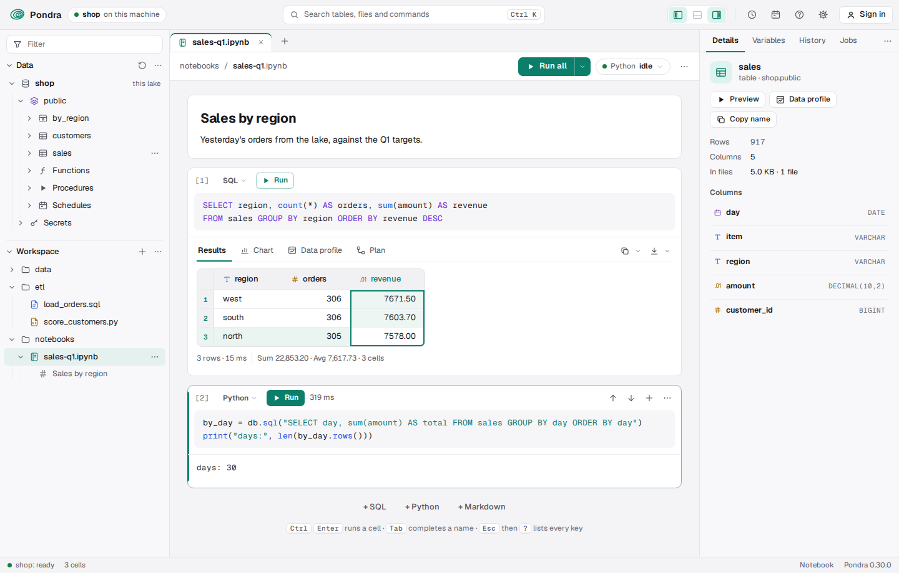
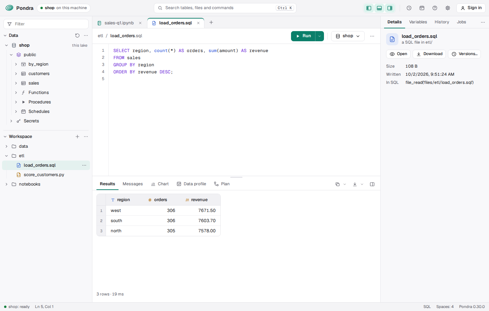

import { Aside } from '@astrojs/starlight/components';

Every Pondra node serves a console at `/`. Open the node's address in a browser and you get the
lake's tables and files on the left, your notebooks, SQL, Python and data files in tabs in the
middle, and on the right the details of whatever you pick and your Python variables. There is nothing
to install. The page is part of the `pondra` binary: the code it loads first is under 70 KB
compressed, the rest (charts, plans, History, Jobs, Settings, Markdown, data files) loads the first time you use it,
and its fonts are 53 KB. It works offline, and it sends requests only to the node that served it.



## Open it

Start a node and open its address:

```bash norun
pondra serve lake        # then open http://localhost:8080
```

- **The shell** starts a node too. Its second line is the console's link, with the shell's key:
  `The console, as this shell: http://127.0.0.1:37957/#key=…`. Open it while the shell runs, and the
  page works as the shell does (it reads this machine's files too).
- **`pondra serve --lakes data`** serves each lake in a folder as a database, and its console
  lists them all. See [Many databases](/pondra/guides/server/).
- **On another machine**, start the node with tokens (`--admin-token`) or make users (see
  [Security](/pondra/guides/security/)). The console asks the first time: a user's name and password
  (it then holds a session the node signs, 12 hours by default), or a token; your browser keeps it.
  **Sign in ▾** in the top bar signs in as someone else, or out.

## The page

- **The top bar:** where the page runs (the database, this node), **search** (**Ctrl+K**: tables,
  files and commands), the three pane switches (left, bottom, right), **History** (the clock: it opens
  the right pane at History, and a second click closes it), **Jobs** (the calendar, the same way), the
  keys (**?**), **Settings** (the gear) and **Sign in**.
- **The left pane:** a **Filter** box, then **Data** (databases, schemas, tables, views, columns) and
  **Workspace** (the lake's files). The filter narrows both trees to the names that hold what you
  type; **Esc** clears it.
- **The middle:** a tab per open file. A dot on a tab (and beside the file in the Workspace) means
  it has changes not saved; a new file gets it once you type in it. The file's toolbar shows **Save**
  only when there is something to save, and **Ctrl+S** saves the one in front.
- **Many tabs** keep their names and scroll: the wheel over them scrolls them, a thin bar above them
  shows where you are (drag it), and **⌄** at their right lists them all. **Right-click** a tab to
  **Pin** it: a pinned tab stays at the left, always in sight, shows a pin instead of its **✕**, and
  isn't closed by **Close others**, **Close to the right**, **Close saved** or **Close all**, which the
  same menu has. Pinned tabs are pinned again next time.
- **The right pane:** **Details**, **Variables**, **History** (what ran: the node's runs, and what
  this page ran) and **Jobs** (what runs on its own: the schedules). Drag a tab to put it in another place. Details follows the tab in front; a
  table you pick stays there until you switch tabs. In a window up to 1180 px wide the pane opens
  over the page when you pick a table or a column, and closes as soon as you go back to your work.
- **Each view's ⋯** moves it to the other pane: Workspace can sit as a tab on the right, for
  instance. Drag a pane's edge to set its width (a double-click resets it).

### Settings

The gear at the top opens Settings (**Esc**, its **✕** or a click outside it closes it). Its sections
are at the left, grouped, and **Search settings** at the top finds a setting in any of them:

- **Appearance:** the theme (light the first time, dark, or as the system is); the accent, one of a
  few or a colour of your own, and the background, for each theme (**Default** puts the theme's
  back: the panes, lines and pop-ups take their shades from it); the font, the console's own (Geist)
  or the system's.
- **Editor and results:** a SQL file's statements (an answer for each, or only the last one's), where
  its results show (below or at the right), and how pages of rows and Format work.
- **Layout:** Data first or Workspace first on the left, and **Reset the layout** (the panes, their
  widths and their tabs, as they were at first).
- **Keys:** every key, where it works (**?** opens Settings here).
- **This node:** **Python** (the one in use, and **Choose…**) and **About** (the version, the lake,
  the cluster, and where the settings are kept).

Sections an extension (or an enterprise build: users, tokens, audit) adds show here too, under their
own heading: `register.setting` below.

The node keeps them on its machine, so every lake and every session you open on that machine has
them: in `PONDRA_CONFIG_DIR` if it is set, else `%APPDATA%\pondra` on Windows,
`~/Library/Application Support/pondra` on a Mac, and `~/.config/pondra` elsewhere
(`console.json`). A page opened from another machine keeps its own, in its browser.
- **The tabs you had open** open again next time, and the address (`#notebook=…`, `#file=…`) opens
  one directly.
- **In a narrow window** the side panes become drawers that close when you use the page.

## Files in tabs

Click a file in the Workspace to open it in a tab (its tab comes forward if it is open):

| File | Opens as | Below it |
|---|---|---|
| A notebook (`notebooks/<name>`, or an `.ipynb` in any other folder) | cells: SQL, Python and Markdown | — |
| `.sql` | an editor with line numbers | Results, Messages, Chart and Plan (or at the right) |
| `.py` | the same editor | a console: the file's runs, and a `>>>` line |
| `.csv`, `.tsv`, `.json`, `.jsonl`, `.parquet` | a table: CSV and JSON edited in place, Parquet read-only | — |
| `.md`, `.txt` | the editor (**Preview** draws a `.md` file's Markdown) | — |

The Workspace's **+** (the tab bar's too) makes a notebook, a SQL or a Python file, or a folder, or
puts a file from your computer in the lake (**Upload a file…**). A new file is in the Workspace at
once, in the folder it will be saved to; it is not in the lake until you save it, and it asks for its
path the first time you do.

A file is saved where it is: **Ctrl+S** replaces it in the lake. If someone else saved it since you
opened it, your save is refused and theirs kept; open it again, or save under another name. (Over
HTTP, it's `If-Match`: see [Files](/pondra/reference/http/#files).) Every node reads the new file at
its next statement.

### Folders

**New folder** (in a **+** menu, or **New folder here** in a folder's menu) asks for a name (`a/b`
makes both) and makes the folder. A lake holds files, not folders, so an empty folder is a zero-byte
file, `<folder>/.folder`, put as any file is. The console never lists it, in the Workspace or in
search. A folder shows while it holds a file or a marker.

Each row of the Workspace has a **⋯**. It shows when you point at the row, focus it, or have it
picked, and opens what a right-click opens. A file's menu opens, renames, downloads and deletes it.
A folder's menu has **New notebook here**, **New SQL file here**, **New Python file here**, **New
folder here**, **Upload a file here…** and **Delete folder…**, which says how many files go, then
deletes them all, the marker too.

### SQL files



**Run** (**Ctrl+Enter**) runs what is selected, or else the whole file. Its **▾** has **Run
selection**, **Run file**, **Format file**, **Format selection**, **Create as table or view…**,
**Run as a job** and **Schedule…**; a right-click in the editor has them too, and **Save as…**.
**Create as** makes the statement at the caret (or the selection) a table (its rows as they are now),
a view (its query, run when read) or a materialized view (kept up to date as its tables change),
showing the `CREATE … AS` it runs; **Open in a new tab** gives you that SQL to change first.

- **Each statement gets an answer.** They run in order in the page's session, and stop at the first
  that fails. Above the results, a chip per statement (`1 done`, `2 5 rows`, `3 failed`) picks the
  one shown, and **Messages** lists them all with how long each took. A `;` inside a string, a
  comment or a `$$` body doesn't end a statement.
- **Settings → A SQL file's statements → The last one's answer** runs the file at once instead and
  shows only its last statement's answer.
- **A `$name` in the file** gets an input above the editor. **Run** sends the values with the
  statements, and the node binds them (numbers and `true`/`false` as such, the rest as text); the
  browser keeps them for the file.
- **Messages** lists every statement that ran: its SQL, how long it took, and what it did (`rows
  3`), printed or said. Click one to see it all.
- **Chart** draws the rows: bars, lines, areas, points or a pie, by any column, of any of the number
  columns (the chart picks lines over time, else bars, until you pick). **Save** keeps it as a PNG
  picture or an SVG drawing.
- **Plan** draws the statement's plan as a graph: each step (a scan, a filter, a join, an
  aggregate) above the steps it reads from, and a dashed box where rows move between cores, or
  between nodes when a query is spread. **Text** shows `EXPLAIN` as it is. **Query profile** runs
  the statement with `EXPLAIN ANALYZE` (it does run it) and puts each step's rows and time on it,
  the costliest marked in red, so you see where the time goes.
- **Data profile** summarizes each column of the answer: its share of NULLs, its distinct values, its
  least and greatest value, and a histogram or its commonest values, from the rows shown; **Profile
  every row** runs it over the whole answer when there are more pages. (Two words, two things: a
  *data* profile is about the rows, a *query* profile about the time the query took.)
- **Copy** (at the right of the tabs) copies the rows, or the selection, tab-separated with
  the headers; its **▾** has the other forms: without the headers, CSV, JSON, a Markdown table, SQL
  `VALUES` rows, a SQL list for `IN (…)`, or the columns' names. **Download** runs the statement
  again on the node and saves every row, not only the ones shown: CSV, TSV, JSON, JSON lines,
  Parquet or Excel (`.xlsx`).
- The results sit below the editor or at its right (the button at the right of their bar); drag the
  line between them. In a narrow window, the results give way to keep their buttons in reach.
- **Right-click** in the editor for cut, copy, paste, select all, comment the lines, the Run ▾'s
  items (above), **Format file** and **Format selection**: the SQL words in capitals and each clause on its own line, strings,
  names and comments as you wrote them. **Shift+Alt+F** formats the selection, or with nothing
  selected the whole file. Anything it can't format stays as it was.

### Python files

**Run file** runs it in the page's Python, the one the notebooks' Python cells share: what it printed
and its answer show in the console below. Type a line after `>>>` and press **Enter** to run it there
too (**↑** **↓** bring back the ones before).

**Format file** and **Format selection** (**Shift+Alt+F**, a right-click, or **Run ▾**) format it as
[ruff](https://docs.astral.sh/ruff/formatter/) does, by the node's Python: it needs `ruff` (or
`black`) installed there (`pip install ruff`). Code that doesn't parse stays as it was, and the
message says where it went wrong.

### Jobs and schedules

A file's **Run ▾** (and a notebook's, in `notebooks`) runs it on the node, where it goes on without the page:

- **Run as a job** saves the file and starts it, with the parameters' values as they are now.
- **Schedule…** makes a task that runs it every so often (`15 minutes`, `1 day`, or a cron line such
  as `cron 0 2 * * * UTC`).

**Jobs**, in the right pane (or the calendar at the top), is what runs on its own. Each schedule is a
card: its name and whether its last run worked, how often it runs and when next, a bar for each of its
last runs (its height the time it took, red if it failed), and the statement it runs. Click the card
for its last runs; **Run now** starts it at once (a `CALL` as a job), **Edit** changes how often,
and its **⋯** opens its file, copies the statement, or drops it. **New schedule** makes one from any
statement. Pipelines (round 30) will be a section here too.

**History**, in the right pane (or the clock at the top), is what ran:

- **On the node:** its runs, newest first: what ran (a file, a procedure, or a Python cell's first
  line of code), its id, who ran it and when, how long it took or its error; a schedule's runs are
  tagged with its name (click the tag for Jobs). A running one's row updates until it ends. Click one
  for all of it (a cell's whole code) and to open its file, or open the code in a new file;
  right-click to copy its id.
- **This page:** each statement and Python run from this page, its SQL shortened to a line, with its
  number (`#3`), its file, the time and its rows. Click one to see it whole, and to **Open in a new
  file**, **Put it in the tab in front**, **Copy it**, **Run it again** or **See its plan**; a
  right-click gives the same.

It's the workspace of [Run files as jobs](/pondra/guides/workspace/).

### Data files

A CSV or JSON file opens as a table you can edit: double-click a cell (or select it and type), **Enter**
keeps the value, **Tab** moves right, **Esc** undoes. **Add row** and **Add column** are below the
table. A changed cell is tinted, a new row too, until you save; the toolbar says what changed, with
**Discard** and **Save**. The lines you didn't touch are saved
exactly as they were. **Query with SQL** reads the file as a table in a SQL tab. A Parquet file, or
a file over 10 MB, opens read-only (the first 10,000 rows): load it into a table to change it. A
JSON file that isn't a list of rows (a settings file, say) opens as text.

## Answers, in a grid

Every answer (a cell's, a SQL file's) and every data file is shown in the same grid:

- **Types:** a coloured mark before each column's name (`T` text, `#` whole numbers, `.01`
  decimals, a calendar or a clock for dates and times, a switch for true/false, braces for JSON-like
  values). Hover over a header for its full type, least and greatest value, NULLs and distinct values
  (the card shows above the pointer, so it hides no rows).
- **Selecting:** click a cell and its whole row lights up, to follow it across a wide table. Drag or
  **Shift+click** for a range, a row number for a row, a header for a column (and its profile in
  Details), the corner for everything. The arrow keys move (**Shift**: extend), **Ctrl+A** takes
  all. The bar below shows the selection's sum and average.
- **Copying:** **Ctrl+C** copies tab-separated, so it pastes into a spreadsheet as cells;
  **Ctrl+Shift+C** adds the headers. Right-click for Copy as CSV, JSON, SQL `VALUES` rows or a SQL
  list of every value selected, **Filter to these values**, Sort and Profile.
- **A header's right-click:** copy the column's name (or the names of the columns selected), as SQL
  too; copy its values with the header; sort; filter; profile it.
- **Filtering:** **Filter *column*…** asks how to compare (contains, starts with, does not contain,
  `=`, `≠`, `>`, `≥`, `<`, `≤`, is NULL, is not NULL) and the value. A chip below the grid shows the filters:
  click it to change the last one, its **✕** clears them all. Each column has one filter, and they
  all apply.
- **Sorting:** the small arrow in a header sorts by it (again: the other way).
- **The line under it** (a SQL file's answer and a cell's alike) says how many rows there are and
  how long they took (`200,000 rows · 28 ms`), the filters, and the selection's sum and average.
- **Pages:** an answer of more than 10,000 rows comes a page at a time. At the right of the line
  under it, `10,001–20,000 ▾` says which rows show, and **‹ ›** turn the pages (**Alt+Page Down**
  and **Alt+Page Up** in the grid). Its **▾** goes to a page, the first or the last, and sets the
  rows a page (100 to 50,000), for this answer and those after it; so does **Settings → Editor and
  results → Rows a page**. The node keeps the answer a while
  (`PONDRA_PAGES_MB`, 256 MB in all, for 20 minutes after it was last read), so a page is the same
  rows, in the same order, without running the query again; after that, turning a page runs it again
  for that page. Sorting and filtering are of the page shown.

## SQL cells

Type SQL and press **Ctrl+Enter** (**⌘+Enter** on a Mac), or click the cell's **Run**. The answer
shows below the cell: the rows, each column's type, how many rows there are, and how long it took.
**Tab** completes a name: a table's, a column's (the columns of the tables the cell names come
first), a function's or a SQL word. After a table's name or its alias and a dot (`o.`), it lists
that table's columns; after a schema's (`sales.`), its tables. When several fit, it lists them;
**↑** **↓** and **Enter** pick one.

```sql
SELECT item, count(*) AS sales, sum(amount) AS total
FROM sales
GROUP BY item
ORDER BY total DESC;
```

- A cell may hold several statements. They run in order, and the cell shows the last one's answer
  (a SQL file shows each one's).
- A statement that changes something (`INSERT`, `CREATE TABLE`) shows what it did, such as
  `rows 3`, and the tables on the left update.
- Errors come back in plain words, such as `No field named nope. Did you mean 'sales.item'?`.
- An answer looks as a SQL file's does: **Results**, **Chart**, **Data profile** and **Plan** as
  tabs above it (a chart of the rows, each column summarized, and the plan as a graph with its
  **Query profile**), **Copy ▾** and **Download ▾** at their right, and the line under it with the
  rows, the time and the pages. The tab open, and the chart's settings, are kept with the notebook,
  so it opens with its chart. **Copy ▾** copies the rows shown in any of the forms a SQL file
  offers, and **Download ▾** saves them as CSV, TSV or JSON; a cell that is one query can also
  download every row (it runs again on the node).
- Decimals keep their digits (`1.50`), and integers too big for JavaScript arrive as text, so what
  you see is exactly what the lake holds.

A long answer scrolls smoothly however many rows it has: the page draws only the rows in sight.
Click a column's header and the details panel summarizes that column; **Data profile** summarizes them all.

### SQL and Python cells, one page

A SQL cell and a Python cell see each other's work, in both directions:

- **A SQL cell's answer in Python.** Type a name in the cell's **→ name** field, beside Live. Once
  the cell runs, that name is a [frame](/pondra/guides/dataframes/) of its query in the page's
  Python: `df.to_pandas()`, `df.to_polars()`, `df.filter(…)`. A frame is the query, not a copy, so
  it reads the lake as it is when used. In the `.ipynb` file the cell begins `%%sql df <<`, as
  Pondra's Jupyter magic writes it, and a notebook run as a job does the same.
- **Python's tables in a SQL cell.** A SQL cell that names a pandas, Polars or Arrow table, or a
  frame, that a Python cell made reads it by that name. The table is sent along with the query, as
  `db.sql` sends it, and a table in the lake wins over a variable of the same name.
- Temporary tables and views (`CREATE TEMP VIEW`) are the page's too, seen from both kinds.

```python cell
import pandas as pd
targets = pd.DataFrame({"item": ["tea", "cake"], "target": [3, 1]})
```

```sql norun
-- a SQL cell on the same page: `targets` is the Python cell's
SELECT s.item, count(*) AS sold, t.target
FROM sales s JOIN targets t USING (item)
GROUP BY s.item, t.target ORDER BY s.item;
```

```text
item  sold  target
cake  1     1
tea   2     3
```

## The lake, on the left

- **Data: tables and views.** Each kind has its icon: a table a grid, a view the same grid drawn
  dashed, a materialized view a grid with a solid header, and a view of files (`CREATE EXTERNAL
  TABLE`) a page with a grid on it. Open one to see its columns: each has its type's coloured mark
  and its SQL type on the right; a key column has a key.
- **Click** a table or a view to see its details on the right. **Double-click** it for its first
  100 rows: in a new cell when a notebook is in front, else in a new SQL tab. Click a column to put
  its name where you are typing.
- **Right-click** anything for what can be done with it, each as the SQL it runs (a change that
  can't be undone asks first):
  - a table, a view or a materialized view: **Preview** (in SQL or Python), **Details and data
    profile**, **Watch it live**, **Script as…**, **Insert rows…**, **Download every row…**, **As a
    Kafka topic…**, **Add a column…**, **Rename…**, **Copy the name** (or as Python), **Truncate…**
    and **Drop…**. **Script as** shows its `SELECT`, `INSERT`, upsert, `UPDATE`, `DELETE`, `MERGE`,
    loading a file, exporting, `CREATE` (from the catalog: its columns, key, partitioning, options)
    and `DROP`, each in SQL or in Python (`db.table("t")`, `db.sql(…)`), to open in a tab or copy;
  - a column: its values counted, its range and NULLs, **Rename…**, **Change its type…**, **Drop…**;
  - a schema: a new table, view, materialized view or external table in it (a template in a new
    tab), **Drop…**;
  - the lake: a new schema or table, **Attach a lake or catalog…**, a new database (a server's),
    **Checkpoint**, **Refresh**, and for an attached one **Detach…**;
  - **Functions**, **Procedures**, **Schedules** and **Secrets**, listed under the lake: each one's
    definition, use or call, start as a job, schedule, and drop; a secret's values are never shown,
    only replaced.
- **Workspace** lists the lake's own files (`PUT /files/…`, `files()`) by folder, and your
  notebooks under `notebooks`, with the headings of the one in front as its outline. A new file not
  saved yet is listed too, with the dot. Whoever may read the lake may read its files, from SQL too.

## The details panel

The panel on the right (its button is at the top right) shows what you picked:

| Picked | It shows |
|---|---|
| A table | rows, columns, key, partitioning, clustering, the formats it is published in, and its size in files; each column with its type, `NOT NULL` and default |
| A view | its definition, and its columns |
| **Data profile** (a table's or a view's) | each column's share of NULLs, its distinct values (approximate), its least and greatest value, and a histogram (numbers, dates, times) or its five commonest values. It reads the whole table: the numbers are the table's, not a sample's |
| A column of an answer | the same, from the rows the answer holds |
| A file | its size, when it was written, and how SQL reads it |
| Nothing | the lake: its tables, views, rows and size, and its cluster |

## Python cells

A Python cell runs on the node, next to the data. `db` is the connection. What the code prints shows
under the cell, and its last line, if it is an expression, comes back as rows: a
[frame](/pondra/guides/dataframes/), a pandas or Polars DataFrame, an Arrow table, a list of dicts,
or one value.

```python cell
by_region = db.table("sales").group_by("region").agg(pondra.col("amount").sum().alias("total"))
print("regions:", len(by_region.rows()))
by_region.sort("total", descending=True)
```

Cells share variables, as in a notebook: the next cell sees what this one made.

```python cell
best = by_region.sort("total", descending=True).rows()[0]
print("best region:", best["region"], best["total"])
```

The node runs a Python cell as Postgres's anonymous code block, `DO LANGUAGE python`. You can send
the same block from psql or any client:

```sql
DO LANGUAGE python $$
print("tea sold:", db.sql("SELECT count(*) FROM sales WHERE item = 'tea'").item())
$$;
```

- The node needs Python: start it with `--python auto` (the Python that has the `pondra` package) or
  `--python /path/to/python`. `pondra.local()` does this for you.
- A Python cell needs an admin token, since it runs code on the node. With no tokens set, the node
  listens only on `127.0.0.1`, and anyone who can reach it is its admin.
- A page is a session, and its Python cells run on one Python worker kept for that session, in one
  namespace, like a notebook kernel. What one cell makes (variables, imports, functions, frames such
  as `orders = db.table("sales")`), the next cell sees. A cell that fails keeps what it did before the
  failing line. `_` holds the last answer, and a cell's single value comes back as a column named
  `value`. One cell runs at a time.
- The session's Python ends when you close the page (or, in psql, when the connection closes), after
  `PONDRA_SESSION_IDLE_SECS` (3600) seconds idle, or if it grows past `PONDRA_WORKER_MB` (2048) MB.
  The next cell then starts empty, and a notice says so.
- A `DO` block sent without a session runs fresh and shares nothing. In psql, a connection is a
  session. Over HTTP, send the `x-pondra-session: <id>` header, as the Python and JavaScript clients
  do: see [Functions and procedures](/pondra/guides/functions-and-procedures/#cells-that-share-variables).
- A Python error names its line in the cell: `ZeroDivisionError: division by zero, line 2: 1 / 0`.
- **Stop** (the cell's Run button while it runs, or **Interrupt** in the Python menu) interrupts the
  cell on the node: it ends with `KeyboardInterrupt`, and its variables stay. On Windows, where one
  process can't interrupt another, Python restarts instead and the variables go. A cell whose page
  stopped waiting for it never holds up the next one.

### Which Python

The **Python** chip in a notebook's (or Python file's) toolbar says whether Python is running, and
its menu interrupts a cell, restarts Python, shows the variables, and has **Choose the Python…**.
That lists every Python the node finds on its machine (on the `PATH`, the `py` launcher's, conda's
and virtual environments' among them), each with its version and whether it has `pondra` and
`pyarrow`, and for one that lacks them the `pip install` command to run. Pick one, or give a
Python's path. The choice is the node's from then on, kept on its machine for next time (beside the
settings, `python.txt`).

With `--python auto`, the node tries the Pythons it finds at once and takes the first that works;
one that doesn't answer within `PONDRA_PYTHON_PROBE_SECS` (15) seconds is passed over, so a broken
install never holds it up. If Python can't start, the message says why, with what it printed.

### Figures

A figure shows under the cell as a picture: a matplotlib figure (or seaborn's) that the cell ends
with, or draws with `pyplot`, and a Pillow image.

```python cell norun
import matplotlib.pyplot as plt
by_day = db.sql("SELECT day, sum(amount) AS total FROM sales GROUP BY day ORDER BY day").to_pandas()
fig, ax = plt.subplots(figsize=(7, 2.5))
ax.plot(by_day["day"], by_day["total"])
fig
```

The node needs matplotlib (or Pillow) in its Python for this: `pip install matplotlib`.

### Variables

The **Variables** tab of the panel on the right lists what this page's Python holds: each name,
its type, its size (a frame's rows and columns, a list's length) and a short look at it (a
frame's columns). **Tab** in a Python cell completes these names.

The **Python** chip says whether a cell is running. **Restart Python** in its menu (or **0 0** on a
cell after **Esc**) ends it: its variables go, and the next cell starts afresh (temporary tables stay,
since they are SQL's).

## Markdown cells

Markdown cells hold text, drawn as GitHub draws Markdown: headings (`#` to `######`, or underlined),
**bold**, *italics*, ~~strikethrough~~, `code`, links (`[text](url)`, `<url>`, a bare `https://…`, or
`[text][name]` with `[name]: url` below), pictures (``), lists (nested,
numbered, and of tasks: `- [ ]`, `- [x]`), quotes, tables (with `:--:` to align their columns), rules
(`---`) and code blocks (SQL and Python ones highlighted). A few HTML tags work as they are
(`<br>`, `<kbd>`, `<sub>`, `<sup>`, `<u>`, `<mark>`); any other HTML shows as text.

A link or a picture without a scheme is a file of the lake's (`data/chart.png`, `queries/daily.sql`):
a link opens it in a tab, a picture is read from the lake. Press **Shift+Enter** to draw the cell, and
double-click it to edit. Its headings make the notebook's outline, under it in the Workspace: click
one to go to its cell. A `.md` file's **Preview** draws it the same way, its paths read from its folder.

## A cell's menu

Point at the space between two cells (or above the first) for **+ SQL**, **+ Python** and **+
Markdown**: each adds a cell there. **A** and **B** add one above or below the cell picked, and so
do its **⋯**'s **Add a cell above** and **Add a cell below**.

The kind at a cell's top left (**SQL ▾**) makes it SQL, Python or Markdown, and back again. The **⋯** at
its top right (it shows when you point at the cell) runs the cells above it, or this one and those
below; hides its output (**O**: its code stays, and a click on the output brings it back); clears
its output; and deletes it. A right-click in its code has cut, copy, paste, comment, **Run cell**,
**Run the cells above**, **Run this and the cells below**, **Format cell** and **Format selection**
(**Shift+Alt+F**: SQL here, Python by the node's ruff or black, as in files), a SQL cell's **Create
as table or view…**, and **Make it Python** (or **Make it SQL**): the same query either way, `SELECT
…` becoming `db.sql("""SELECT …""")` and back, so any cell moves between the two.
The notebook's own **⋯** (in its toolbar) shows its **Versions…**, downloads it as `.ipynb` and
clears every output. **Ctrl+K** finds every command: a new notebook, file or folder, **Upload a file…**,
restarting or choosing Python, the token, the keys.

## Live answers

A SQL cell's **Live** switch keeps its answer current. The node sends the answer again each time a
commit changes a table the query reads, and the console redraws it. Nothing runs while nothing
changes. Turn the switch off and the query stops.

```sql
SELECT region, sum(amount) AS total FROM sales GROUP BY region ORDER BY region;
```

With **Live** on, an `INSERT` into `sales` from anywhere (another cell, psql, a Kafka producer, a
program appending over HTTP) shows in the cell within a fraction of a second. The console uses
[`/live`](/pondra/guides/query/), which any HTTP client can use too.

## Notebooks

**Ctrl+S** saves the notebook in the lake, under the name in its toolbar:

- It is one file, `files/notebooks/<name>.ipynb`, or `<folder>/<name>.ipynb` in any other folder
  (**New notebook here** in a folder's menu, or an `.ipynb` uploaded there). **Ctrl+S** replaces it
  in place, refused if someone saved it since you opened it, as any file is.
- **Every file keeps its versions**, notebooks or not: each save, with who made it and when.
  **Versions…** in a file's **⋯** (or in the Workspace's menu, or in Details) lists them; pick one to
  see what changed since, line by line, and **Restore this version** to make it the file again. A
  deleted file keeps its versions too.
- A notebook saved before versions, as `notebooks/<name>/<time>.ipynb`, still opens; its next save
  makes it `notebooks/<name>.ipynb`, and its earlier saves are among its versions.
- Any notebook can be a job or a schedule (**Run all ▾**), and a run records the version it ran.
- Everyone who can read the lake can open them. They are files like any other, so you can list them
  in SQL:

```sql
SELECT path, size, written FROM files('notebooks/') ORDER BY written DESC;
```

A notebook is a Jupyter notebook (`.ipynb`, format 4.5). SQL cells are saved as `%%sql` cells,
Python cells as code cells, and Markdown as Markdown. Each answer is kept with its cell (the first
100 rows) and shown, marked **saved**, until you run the cell again; a cell's chart (or plan) open
is kept in its metadata (`pondra.view`, `pondra.chart`).

- **Download** saves the notebook to your computer. Jupyter, VS Code and GitHub open it as it is. In
  Jupyter, `%load_ext pondra` makes the `%%sql` cells run (see [Notebooks](/pondra/guides/notebooks/)).
- **Upload a file…** puts any file from your computer in the lake. An `.ipynb` (from Jupyter or
  anywhere else) opens as a notebook instead, and **Ctrl+S** then keeps it in the lake. **Upload a
  file here…** in a folder's menu puts it in that folder, an `.ipynb` too.

## Keys

The console follows Jupyter's keys. In a cell:

| Keys | What they do |
|---|---|
| **Ctrl+Enter** | Run the cell |
| **Shift+Enter** | Run it, then go to the next cell (a new one at the end) |
| **Alt+Enter** | Run it, then add a cell below |
| **Ctrl+Shift+Enter** | Run every cell, in order (it stops at one that fails) |
| **Tab** | Complete a name (after a letter), or indent |
| **Shift+Alt+F** | Format the cell (or what is selected) |
| **Shift+Tab** | Indent back |
| **Ctrl+Space** | List the names that fit here |
| **Esc** | Leave the cell, for the keys below |

After **Esc**, on the selected cell:

| Keys | What they do |
|---|---|
| **Enter** | Edit it |
| **↑** **↓** (or **K** **J**) | Go to the cell above or below |
| **A**, **B** | Add a cell above, below |
| **D D** | Delete it. **Z** brings it back |
| **S**, **P**, **M** | Make it SQL, Python or Markdown |
| **L** | Turn Live on or off |
| **O** | Hide its output, or show it again |
| **0 0** | Restart Python |
| **?** | Show these keys (Settings, Keys) |

Anywhere on the page:

| Keys | What they do |
|---|---|
| **Ctrl+S** | Save the file or notebook in front |
| **Shift+Alt+F** | Format the SQL or Python file in front (or what is selected) |
| **Ctrl+K** | Search tables, files and commands |
| **Ctrl+B**, **Ctrl+J**, **Ctrl+Alt+B** | Show or hide the left pane, the bottom panel, the right pane |
| **↑** **↓** **←** **→** | Move in a tree (open, close) or along the tabs; **Delete** closes a tab |
| **Alt+Page Down**, **Alt+Page Up** | The next page of an answer's rows, the one before (in its grid) |

## The cluster at a glance

The top of the page says where the cells run: the database, this node's role (leader, follower or
reader), how many nodes the lake's cluster has, and how many live queries are open. Hover over it for
the nodes' addresses. A query the node spreads over the cluster runs from the console like any
other: see [Clusters](/pondra/guides/clusters/).

The page is light the first time; Settings makes it dark, or follow the system's setting.

## Extend it

The console is built to be added to: its own sections, tabs, kinds of cell and actions are
registered through the same small API an extension uses, `window.pondra`. Give a node the scripts
in `PONDRA_CONSOLE_EXTENSIONS` (separated as `PATH` is), and the page loads them after its own:

```bash norun
PONDRA_CONSOLE_EXTENSIONS=./history.js pondra serve lake
```

```js norun
const { register, on, ui, api } = window.pondra;

// A section on the left (a view: its ⋯ moves it to the right, as the console's own).
register.section({ id: 'history', title: 'History', render: box => box.append(ui.h('div', {}, '…')) });
// A kind of file: what opens in a tab for these paths.
register.doc({ id: 'dash', match: path => path.endsWith('.dash'), open: async path => myDashboard(path) });
// A tab of the panel on the right: what was picked on the left.
register.panel({ id: 'sample', title: 'Sample', render: async (box, picked) =>
  picked?.type === 'object' ? (await api.rows(`SELECT * FROM ${picked.t.q} LIMIT 5`)).map(r => ui.h('pre', {}, JSON.stringify(r))) : [] });
// A view of an answer: the first one that matches draws it.
register.renderer({ id: 'figure', order: 15, match: r => r.kind === 'rows' && r.rows.length === 1, render: r => ui.h('b', {}, String(r.rows[0][0])) });
// An action: a button at the top, or an item of a ⋯ menu there (it shows once one is added).
register.action({ id: 'share', menu: true, icon: 'copy', title: 'Share', run: () => ui.toast('Shared') });
// Events: 'start', 'run', 'ran', 'pick', 'refresh', 'changed'.
on('ran', (cell, answer) => console.log(cell.src, answer.kind));
```

| `register.` | Adds |
|---|---|
| `view({ id, title, side, render(box, picked), tools, order })` | a view, on the left (`side: 'left'`) or a tab on the right |
| `section({ id, title, render(box), tools, order })` | a view on the left |
| `panel({ id, title, render(box, picked), order })` | a view on the right |
| `doc({ id, match(path), open(path) })` | a kind of file, opened in a tab |
| `cellKind({ id, label, language, placeholder, run(text, signal) })` | a kind of cell |
| `renderer({ id, match(answer), render(answer, cell), order })` | a view of an answer |
| `action({ id, label or icon, title, run(), primary, menu, order })` | a button at the top, or an item of the top bar's ⋯ (shown once an extension adds one) |
| `nav({ id, label, icon, run() })` | a place in a rail at the far left (it shows once one is added) |
| `key({ keys, title, run(cell), group })` | a key on a cell, listed under **?** |
| `setting({ id, title, group, icon, about, rows(), order })` | a section of Settings: `rows()` gives `[name, what it does, its control]`, under the heading `group` |
| `jobKind({ id, title, load(), item(x), empty, order })` | a section of Jobs: what `load()` gives, each drawn by `item` |

`pondra.configure({ fetch, token, headers })` changes how the page reaches the node, for a
gateway or a sign-in of your own. `pondra.api` runs SQL (`run`, `rows`, `call`), and `pondra.ui`
holds the page's own pieces (`h`, `icon`, `line`, `button`, `toast`, `menu`, `pick`, `add`), so an
extension looks like the rest of the page. `pondra.ui.notebook()` gives the notebook as `.ipynb`
JSON and `pondra.ui.open(nb, name)` opens one, for an extension that keeps notebooks elsewhere;
`pondra.ui.openFile(path)` opens a lake file in its tab, and `pondra.docs()` lists the open ones. A
whole example is in the repository:
[`examples/console-extension.js`](https://github.com/alimardon123/pondra/blob/main/examples/console-extension.js).
The console's files are at `/console/` (`console.js` and the modules it loads, some the first time
they are needed, `console.css`, the fonts), and an extension at `/console/ext/0.js`, `1.js`, …; the
browser keeps them until they change.
